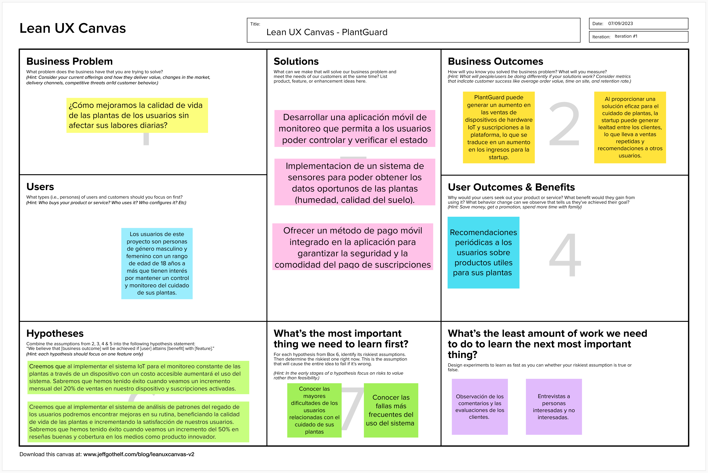

### Startup Profile

#### Descripción de la Startup

Somos un emprendimiento dedicado a mejorar la calidad de vida de nuestros usuarios a través de productos innovadores, utilizando tecnologías emergentes como Internet of Things (IoT).

**Nuestra misión:** Nuestra misión es ofrecer a nuestros usuarios una propuesta innovadora que les permita mejorar la calidad de vida sus plantas.

**Nuestra visión:** Nuestra visión es que nuestro producto sea reconocido a nivel nacional e internacional como una solución innovadora en el campo de Internet of Things para la falta de cuidado de las plantas por parte de las personas.

#### Perfiles de integrantes del equipo

!include (../partials/team-members.html)

### Solution Profile

**Nombre del producto:** PlantGuard

Nuestra startup se basa en el desarrollo de un dispositivo de hardware IoT, el cual combinado con una aplicación móvil es capaz de, a través de sus múltiples sensores como de temperatura y humedad, detectar y predecir cuándo una planta necesita/necesitará ser regada por su dueño. Esto le brinda una mejora en la calidad de vida de sus plantas sin la preocupación constante del dueño de recordar si ha regado sus plantas correctamente. La aplicación también le permite al usuario ver el historial de las veces que se regó la planta, cuál fue la variación en la humedad de la tierra, así como darle constante monitoreo y control al dueño sobre el regado de sus plantas.

#### Problemática

Analizamos la problemática mediante la técnica de las 5W (_Who, What, Where, Why, When_), y las 2H (_How, How Much_):

- **WHO**: A las personas cuidadoras de plantas que se preocupan por el bienestar y calidad de vida de sus jardines y cultivos.
- **WHAT**: Los usuarios quieren un control y monitoreo del bienestar de sus plantas, manteniendo un balance entre su vida laboral/personal sin sacrificar el cuidado de sus plantas al tener estar pendientes de estas por mucho tiempo.
- **WHERE**: En casa de los usuarios cuidadores de plantas.
- **WHY**: En la actualidad, los usuarios no siempre tienen un control correcto del bienestar de sus plantas, debido a las tareas del día a día que deben realizar que le impiden centrar su atención 100% al cuidado de estas plantas.
- **WHEN**: Se observa cuando las personas están realizando otras labores del día a día y se olvidan del cuidado de sus plantas.
- **HOW**: El problema se presenta mediante plantas dañadas o poco cuidadas en los jardines de los usuarios.
- **HOW MUCH**: Este problema se puede observar diariamente, cuando los usuarios necesitan mantener el cuidado de sus plantas pero las labores del día a día se lo impiden.

#### Lean UX Process

#### Lean UX Problem Statement

Hemos notado que los usuarios no siempre cuentan con el tiempo disponible para el cuidado correcto de sus plantas. Esto se debe a múltiple motivos, ya sea un horario laboral complicado, con tiempos de desplazamiento largos. También se presenta en casa cuando las labores del día a día no permiten un tiempo libre para el monitoreo de estas plantas.

También podemos identificar que los usuarios, al no tener las herramientas adecuadas, no son capaces de medir factores como la humedad del suelo o la temperatura, los cuales permitirían tener una mejor idea de cómo hacer un mejor cuidado de estas plantas.

La pregunta que buscamos responder es la siguiente: ¿cómo mejoramos la calidad de vida de las plantas de los usuarios sin afectar sus labores diarias?

##### Lean UX Assumptions

###### Feature Assumptions

- Creo que mis clientes necesitan herramientas y monitoreo de calidad para facilitar la visualización y asegurar el bienestar de sus plantas.
- Estas necesidades se pueden resolver con el desarrollo de un sistema IoT, conectado al WiFi del usuario, el cual permita monitorear diversos valores del ambiente de las plantas y le permita al usuario acceder a estos datos desde un panel de control sencillo desde su teléfono móvil.
- El valor N° 1 que un cliente quiere de mi servicio es la mejora en la calidad de vida de sus plantas teniendo en consideración las limitaciones de la persona, optimizando el regado para el máximo bienestar posible.
- El cliente puede obtener estos beneficios adicionales a través de la aplicación móvil, la cual le permitirá acceder a los datos desde cualquier parte del mundo.
- Haré dinero a través de la venta de los dispositivos IoT necesarios para utilizar el sistema, así como las suscripciones para el uso de la sincronización en la nube.

###### Business Assumptions

<!-- TODO: Use BibTeX for the reference -->

- Mi competencia principal en el mercado serán sistemas similares como el realizado por Absar et al. (2023) que implementan ideas de sistemas IoT para el cuidado de plantas, jardines y cultivos personales.
- Los venceremos debido a que somos un startup especializado en este tipo de tecnologías, buscando la mayor satisfacción de nuestros usuarios al menor costo posible y con la mayor transparencia, mientras mantenemos la privacidad de los datos recopilados de nuestros usuarios.
- Mi mayor riesgo es que las personas decidan que este sistema no es beneficioso para ellos, optando por hacerlo de manera manual o prefieran una alternativa de la competencia.
- Resolveremos esto presentando un producto de calidad, manteniendo la transparencia y protección de privacidad que muchos proveedores en el mercado no pueden garantizar, mientras ofrecemos el precio más accesible para que la mayor cantidad de personas puedan hacer uso de este sistema.
- Conseguiremos retroalimentación mediante los feedback que recibamos mediante nuestra aplicación móvil.

##### Lean UX Hypothesis Statements

- **Creemos que** al implementar el sistema IoT para el monitoreo constante de las plantas a través de un dispositivo con un costo accesible aumentará el uso del sistema. **Sabremos que** hemos tenido éxito **cuando** veamos un incremento mensual del 20% de ventas de nuestro dispositivo y suscripciones activadas.
- **Creemos que** al implementar el sistema de análisis de patrones del regado de los usuarios podremos encontrar mejoras en su rutina, beneficiando la calidad de vida de las plantas e incrementando la satisfacción de nuestros usuarios. **Sabremos que** hemos tenido éxito **cuando** veamos un incremento del 50% en reseñas buenas y cobertura en los medios como producto innovador.
- **Creemos que** al brindar una plataforma abierta para desarrolladores aumentará la utilidad del producto gracias a la comunidad, mejorando asimismo la satisfacción post-compra de nuestros usuarios. **Sabremos que** hemos tenido éxito **cuando** veamos un incremento de 30% en proyectos de la comunidad utilizando nuestra plataforma acompañado de un 30% de incremento en ventas.

##### Lean UX Canvas

Luego de haber aplicado el Lean UX process y abarcar a la visión del modelo de negocio que será soportado por nuestra plataforma, incluyendo el Problem Statement, los Assumptions e Hypothesis Statements, a continuación, se muestra en captura nuestro Lean UX Canvas, el cual se desarrolló en base al Lean UX process previamente realizado.

Se puede acceder al Canvas también a través del siguiente enlace: [Link to Lean UX Canvas.](https://app.mural.co/t/upc96530/m/upc96530/1694166619515/ac4f80f6c6ae9e7f88c93798e850fa0e90c1b538?sender=ua85b805e4c11d590490b6516)

#### Segmentos objetivo

Nuestro segmento objetivo consiste principalmente en los cuidadores de plantas artesanales, que en su propia casa quieren tener un control y monitoreo correcto de sus plantas, manteniendo su bienestar y calidad de vida de estas.
