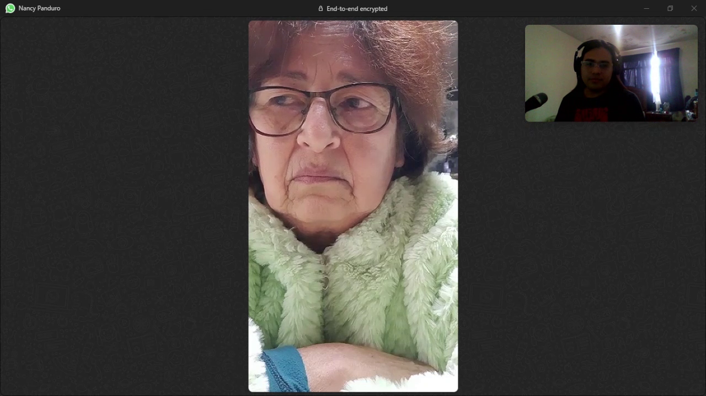
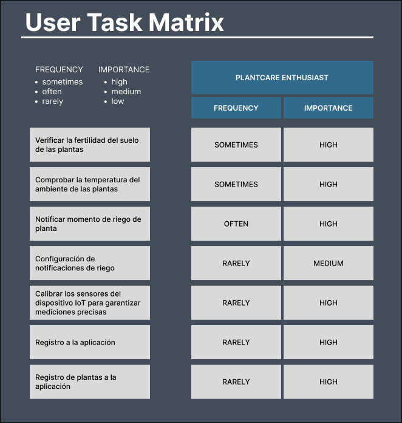

### Competidores

#### Análisis competitivo

Para el análisis competitivo, al no encontrar soluciones comerciales para jardineros, se encontró un trabajo previo realizado en Pakistán realizado por Absar et al. (2023). A continuación, se detallan las diferencias entre PlantGuard y el _paper_ encontrado.

<!-- !include (../partials/analisis-competitivo-tabla.md) -->

!include (../partials/analisis-competitivo-tabla.html)

#### Estrategias y tácticas frente a competidores

Al conocer los puntos fuertes y débiles de una de las posibles competencias, tenemos clara la propuesta de valor a otorgar a nuestro segmento objetivo. Por ello, nuestra principal estrategia se basa en la **diferenciación**, ya que buscamos distinguirnos de otros competidores otorgando un servicio personalizado, que le brinde control y visibilidad de los parámetros y entorno de sus plantas a nuestros usuarios y mantenga el bienestar de estas en todo momento.

De tal manera, nos enfocamos en resaltar tanto la aplicación como nuestra marca dentro del mercado, haciendo prevalecer la calidad y enfoque en las necesidades expresas del usuario.

### Entrevistas

#### Diseño de entrevistas

Se formularon las siguientes preguntas que nos ayudarán a conocer sobre las rutinas, metodologías y actividades de los usuarios propuestos para las entrevistas. A continuación, se muestran las preguntas que se realizar a nuestros entrevistados, quienes serían jardineros aficionados.

- ¿Cuántas plantas aproximadamente cuidas actualmente? Puedes incluir plantas que tengas en casa como en otros lugares pero que usted sea responsable de su bienestar.
- ¿Qué tipos de plantas tiene actualmente?
- ¿Cada cuánto se encarga de regar estas plantas?
- ¿Tiene idea de cuánta agua necesitan estas plantas para tener una vida saludable?
  - Si conoce, ¿cómo obtuvo esta información?
  - Si no conoce, ¿cómo obtendría esta información?
- ¿Lleva usted un control de las veces que estas plantas reciben agua (u otros cuidados, si existieran)?
- ¿Qué es lo que usted hace cada vez que debe cuidar de estas plantas? Mejor dicho, ¿qué tipo de cuidados le da a estas plantas?
- ¿Cuánto tiempo suele tomar de su día para realizar estas actividades de cuidado?
- ¿Hay algún costo asociado con estas actividades de cuidado?
- Si pudiera realizar mediciones sobre el entorno de sus plantas, ¿qué le gustaría medir?
  - Por ejemplo: temperatura, humedad del suelo, pH de la tierra, o alguno otro que usted conozca.
- ¿Qué dificultades presenta, si las hubiera, para mantener sus plantas saludables?

#### Registro de entrevistas

##### Entrevista N°1

- Nombre: Rosa Panduro
- Edad: 67 años
- Residencia: Chile
- Segmento Objetivo: Jardinero aficionado
- Enlace de entrevista: <https://youtu.be/jPeZ02z1d5Y>.
- Resumen: Rosa nos comenta que actualmente ella cuida de aproximadamente 300 plantas, dividas entre su casa en Chile y su residencia en Perú, entre las cuales tenemos tipos como vegetales y plantas ornamentales. Ella suele regar sus plantas, dependiendo de la estación, en verano cada 2 o 3 días pero en invierno cada 15 días. Ella no ha investigado previamente sobre el tema, pero tiene experiencia en ello desde pequeña por el huerto de su mamá y por los años que lleva aprendiendo por prueba y error. Ella no suele registrar cuando riega sus plantas, solo se guía según su memoria. Entre los cuidados especiales que le da a sus plantas, menciona que usa materiales orgánicos como un adicional, como cascaras de fruta. Finalmente, nos detalla que realizar estas actividades le suele tomar un día entero por el tamaño de su jardín.

#### Análisis de entrevistas

<!-- TODO: Improve when we have more interviews -->

En esta sección se realizará el análisis de las entrevistas aplicadas a nuestro segmento objetivo.

En base a la información recopilada, obtuvimos que nuestros usuarios no suelen tener un control preciso sobre el regado de sus plantas. La mayoría son jardineros aficionados, por lo que no tienen estudios específicos en esta materia, solo realizan estas actividades como su pasión. A pesar de ello, si les gustaría tener un control del entorno de sus plantas, a través de mediciones que un sistema como PlantGuard podría proveer.

### Needfinding

#### User Personas

El User Persona cuyo nombre es Daniel Smith es un personaje ficticio que representa a los principales usuarios que tiene PlantGuard, quienes serían los usuarios dueños de las plantas. Este personaje fue creado en base a las entrevistas realizadas.

#### User Task Matrix

Se desarrolló el User Task Matrix para identificar y priorizar las tareas del usuario en función de su frecuencia y importancia, lo que permitirá mejorar la experiencia del usuario y la eficacia del producto PlantGuard, con el fin de elaborar un adecuado User Task Matrix se toma como referencia a los segmentos objetivos identificados, y el análisis de nuestras entrevistas realizadas.

#### Empathy Mapping

Esta herramienta nos permitió entender mejor a nuestro sector objetivo, pues nos permite ver el mundo a través de su perspectiva.

#### As-is Scenario Mapping

