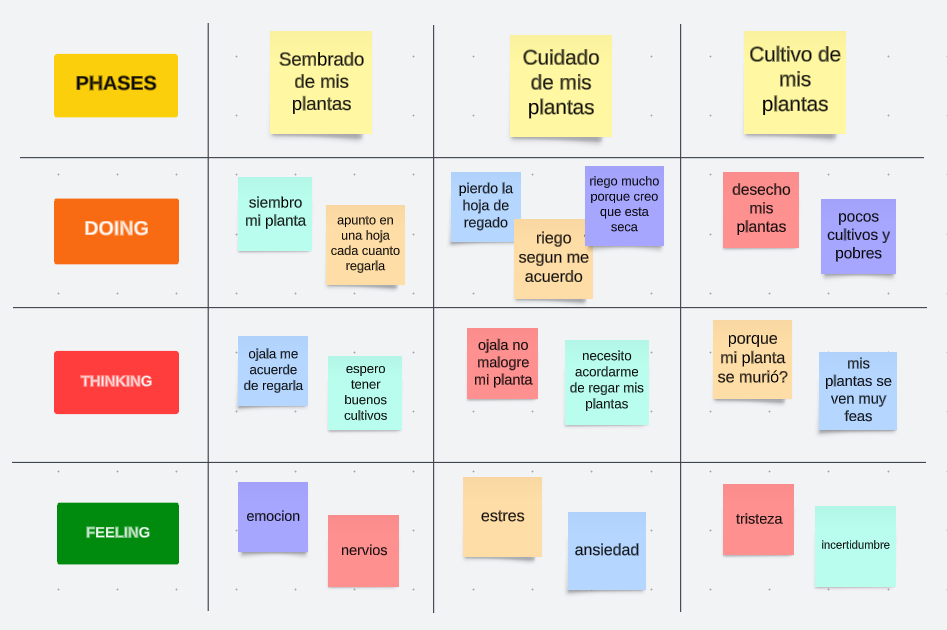

### Competidores

#### Análisis competitivo

<!-- !include (../partials/analisis-competitivo-tabla.md) -->

!include (../partials/analisis-competitivo-tabla.html)

#### Estrategias y tácticas frente a competidores

Al conocer los puntos fuertes y débiles de una de las posibles competencias, tenemos clara la propuesta de valor a otorgar a nuestro segmento objetivo. Por ello, nuestra principal estrategia se basa en la **diferenciación**, ya que buscamos distinguirnos de otros competidores otorgando un servicio personalizado, que le brinde control y visibilidad de los parámetros y entorno de sus plantas a nuestros usuarios y mantenga el bienestar de estas en todo momento.

De tal manera, nos enfocamos en resaltar tanto la aplicación como nuestra marca dentro del mercado, haciendo prevalecer la calidad y enfoque en las necesidades expresas del usuario.

### Entrevistas

#### Diseño de entrevistas

Se formularon las siguientes preguntas que nos ayudarán a conocer sobre las rutinas, metodologías y actividades de los usuarios propuestos para las entrevistas. A continuación, se muestran las preguntas que se realizar a nuestros entrevistados, quienes serían cuidadores de plantas en casa.

- ¿Cuántas plantas aproximadamente cuidas actualmente? Puedes incluir plantas que tengas en casa como en otros lugares pero que usted sea responsable de su bienestar.
- ¿Qué tipos de plantas tiene actualmente?
- ¿Cada cuánto se encarga de regar estas plantas?
- ¿Tiene idea de cuánta agua necesitan estas plantas para tener una vida saludable?
  - Si conoce, ¿cómo obtuvo esta información?
  - Si no conoce, ¿cómo obtendría esta información?
- ¿Lleva usted un control de las veces que estas plantas reciben agua (u otros cuidados, si existieran)?
- ¿Qué es lo que usted hace cada vez que debe cuidar de estas plantas? Mejor dicho, ¿qué tipo de cuidados le da a estas plantas?
- ¿Cuánto tiempo suele tomar de su día para realizar estas actividades de cuidado?
- ¿Hay algún costo asociado con estas actividades de cuidado?
- Si pudiera realizar mediciones sobre el entorno de sus plantas, ¿qué le gustaría medir?
  - Por ejemplo: temperatura, humedad del suelo, Ph de la tierra, o alguno otro que usted conozca.
- ¿Qué dificultades presenta, si las hubiera, para mantener sus plantas saludables?

#### Registro de entrevistas

#### Análisis de entrevistas

### Needfinding

#### User Personas

El User Persona cuyo nombre es Daniel Smith es un personaje ficticio que representa a los principales usuarios que tiene PlantGuard, quienes serían los usuarios dueños de las plantas. Este personaje fue creado en base a las entrevistas realizadas.

#### User Task Matrix

#### Empathy Mapping

Esta herramienta nos permitió entender mejor a nuestro sector objetivo, pues nos permite ver el mundo a través de su perspectiva.

#### As-is Scenario Mapping

