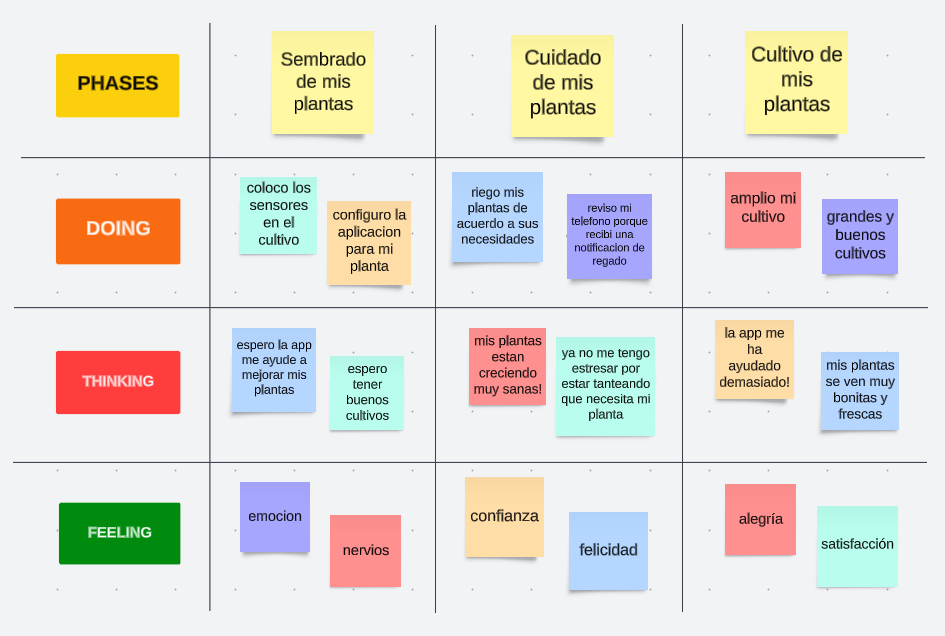
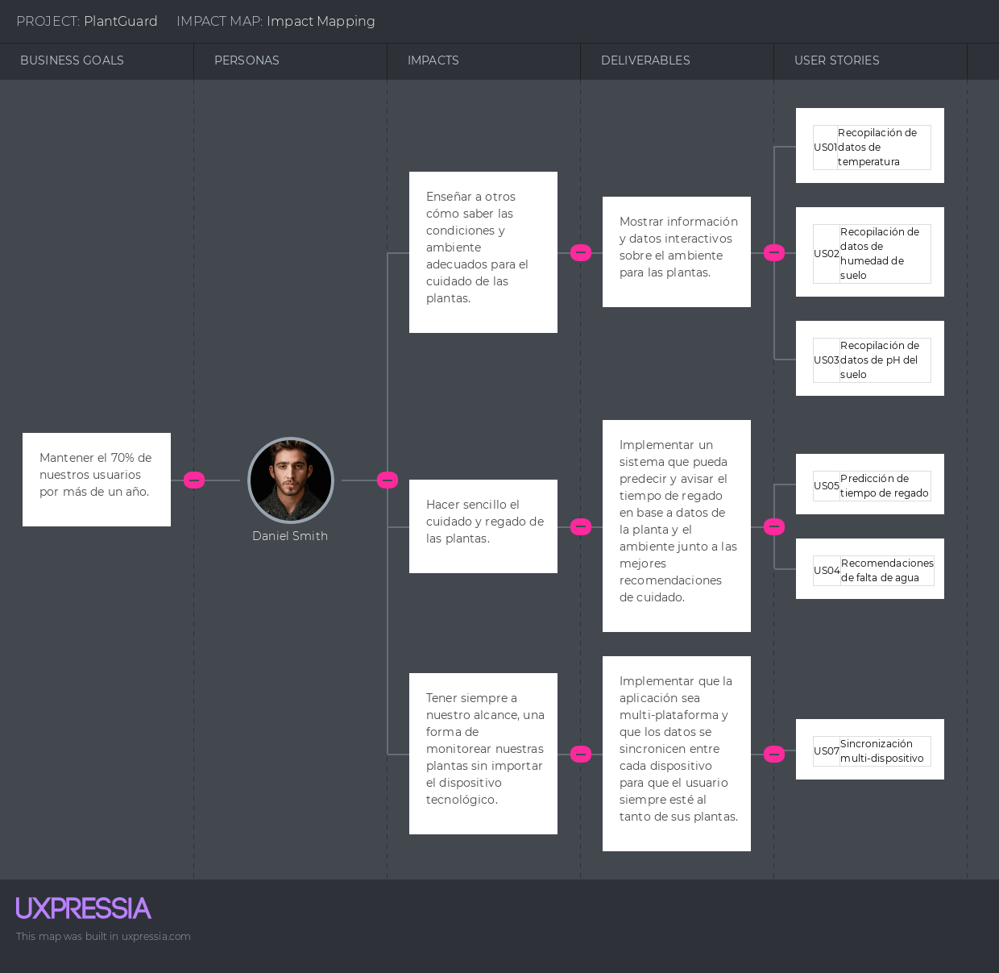

### To-Be Scenario Mapping

### User Stories

A continuación, mostramos las historias de usuario que hemos considerado para este proyecto.

#### Epics

| Epic ID |           Título           | Descripción                                                                                                                                                                                                                        | US Asociados |
| :-----: | :------------------------: | ---------------------------------------------------------------------------------------------------------------------------------------------------------------------------------------------------------------------------------- | :----------: |
|  EP01   |   Recopilación de datos    | Como usuario, quiero que se recopile diferentes métricas de mis plantas para tener visibilidad en su cuidado.                                                                                                                      |      0       |
|  EP02   | Recomendaciones de cuidado | Como usuario, quiero recibir recomendaciones en base a los datos recopilados y mis patrones de cuidado para mejorar la calidad de vida de mis plantas.                                                                             |      0       |
|  EP03   | Sincronización en la nube  | Como usuario, quiero poder acceder a los datos recopilados desde cualquier parte del mundo solo con una conexión a internet para poder verificar que mis plantas están recibiendo cuidados adecuados mientras estoy fuera de casa. |      0       |

#### User Stories

| User Story ID | Título                                    | Descripción                                                                                                                                                                                                                | Epic ID |
| :-----------: | ----------------------------------------- | -------------------------------------------------------------------------------------------------------------------------------------------------------------------------------------------------------------------------- | :-----: |
|     US01      | Recopilación de datos de temperatura      | Como usuario, quiero que se recopile la métrica de la temperatura para llevar un control preciso del ambiente de mi planta                                                                                                 |  EP01   |
|     US02      | Recopilación de datos de humedad de suelo | Como usuario, quiero que se recopile la métrica de humedad de suelo para llevar un control preciso de la tierra en la que se encuentra la planta                                                                           |  EP01   |
|     US03      | Recopilación de datos de pH del suelo     | Como usuario, quiero que se recopile la métrica de pH del suelo para llevar un control preciso de la tierra en la que se encuentra la planta                                                                               |  EP01   |
|     US04      | Recomendaciones de falta de agua          | Como usuario, quiero que la aplicación me recomiende en qué momento debo regar la planta para mantener un bienestar completo de esta                                                                                       |  EP02   |
|     US05      | Predicción de tiempo de regado            | Como usuario, quiero que la aplicación sea capaz de predecir a qué hora la planta necesitará un nuevo regado para estar al tanto de la planta en ese horario                                                               |  EP02   |
|     US06      | Alertas de tierra mala                    | Como usuario, quiero que la aplicación me notifique cuando detecte que la tierra en la que se encuentra la planta no tiene las condiciones necesarias para mantener su bienestar para así poder hacer el cambio respectivo |  EP02   |
|     US07      | Sincronización multi-dispositivo          | Como usuario, quiero tener acceso a los datos recopilados desde cualquiera de mis dispositivos, ya sea en mis teléfonos o en una computadora desde la web para estar al tanto de la planta en todo momento                 |  EP03   |

### Impact Mapping

### Product Backlog

En esta sección se incluirán los User Stories con su respectiva estimación y priorización.

| # Orden | User Story ID | Título                                    | Descripción                                                                                                                                                                                                                | Story Points |
| :-----: | :-----------: | ----------------------------------------- | -------------------------------------------------------------------------------------------------------------------------------------------------------------------------------------------------------------------------- | :----------: |
|    1    |     US02      | Recopilación de datos de humedad de suelo | Como usuario, quiero que se recopile la métrica de humedad de suelo para llevar un control preciso de la tierra en la que se encuentra la planta                                                                           |      8       |
|    2    |     US03      | Recopilación de datos de pH del suelo     | Como usuario, quiero que se recopile la métrica de pH del suelo para llevar un control preciso de la tierra en la que se encuentra la planta                                                                               |      8       |
|    3    |     US01      | Recopilación de datos de temperatura      | Como usuario, quiero que se recopile la métrica de la temperatura para llevar un control preciso del ambiente de mi planta                                                                                                 |      5       |
|    4    |     US05      | Predicción de tiempo de regado            | Como usuario, quiero que la aplicación sea capaz de predecir a qué hora la planta necesitará un nuevo regado para estar al tanto de la planta en ese horario                                                               |      5       |
|    5    |     US04      | Recomendaciones de falta de agua          | Como usuario, quiero que la aplicación me recomiende en qué momento debo regar la planta para mantener un bienestar completo de esta                                                                                       |      3       |
|    6    |     US06      | Alertas de tierra mala                    | Como usuario, quiero que la aplicación me notifique cuando detecte que la tierra en la que se encuentra la planta no tiene las condiciones necesarias para mantener su bienestar para así poder hacer el cambio respectivo |      3       |
|    7    |     US07      | Sincronización multi-dispositivo          | Como usuario, quiero tener acceso a los datos recopilados desde cualquiera de mis dispositivos, ya sea en mis teléfonos o en una computadora desde la web para estar al tanto de la planta en todo momento                 |      2       |
