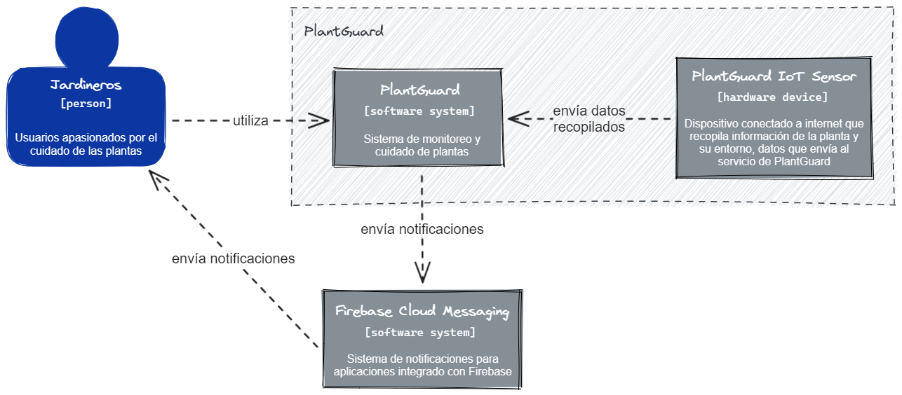
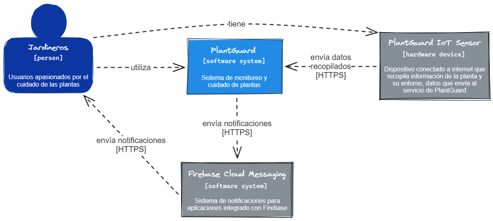
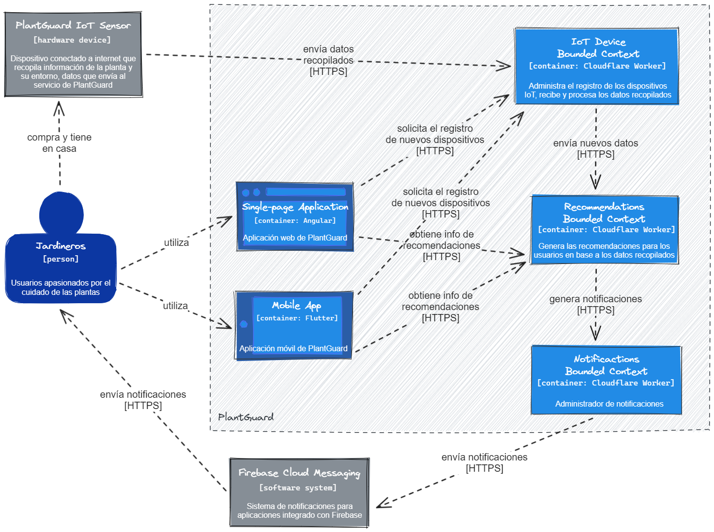

### Strategic-Level Attribute-Driven Design

#### Design Purpose

El objetivo que buscamos con la propuesta de arquitectura es maximizar la mantenibilidad del sistema, reduciendo los tiempos de desarrollo y los problemas generados, sin reducir la calidad del código y manteniendo el nivel de _downtime_ del sistema al mínimo.

#### Attribute-Driven Design Inputs

##### Primary Functionality (Primary User Stories)

Las siguientes historias de usuario (US) son aquellas que se deben priorizar para ofrecerle al usuario una funcionalidad óptima del sistema. De esa manera, la experiencia será provechosa para nuestro segmento objetivo. Asimismo, estas US son del tipo funcional, core del negocio y las que demuestran el valor agregado que queremos otorgar a nuestros usuarios. Gracias a estas, se podrá crear un producto mínimo viable (MVP) y, por ende, brindar solución a la problemática planteada al inicio del proyecto.

<!-- prettier-ignore-start -->
| ID    | User                                  | Priority | Epic |
| ----- | ------------------------------------- | -------- | ---- |
| US03  | Agricultores caseros                  | High     | EP01 |
| Title | Recopilación de datos de pH del suelo                 |||
| **Description**                                              ||||
| Como usuario, quiero que se recopile la métrica de pH del suelo para llevar un control preciso de la tierra en la que se encuentra la planta ||||
<!-- prettier-ignore-end -->

<!-- prettier-ignore-start -->
| ID    | User                                  | Priority | Epic |
| ----- | ------------------------------------- | -------- | ---- |
| US04  | Agricultores caseros                  | High     | EP02 |
| Title | Recomendaciones de falta de agua                      |||
| **Description**                                              ||||
| Como usuario, quiero que la aplicación me recomiende en qué momento debo regar la planta para mantener un bienestar completo de esta ||||
<!-- prettier-ignore-end -->

<!-- prettier-ignore-start -->
| ID    | User                                  | Priority | Epic |
| ----- | ------------------------------------- | -------- | ---- |
| US07  | Agricultores caseros                  | High     | EP03 |
| Title | Sincronización multi-dispositivo                      |||
| **Description**                                              ||||
| Como usuario, quiero tener acceso a los datos recopilados desde cualquiera de mis dispositivos, ya sea en mis teléfonos o en una computadora desde la web para estar al tanto de la planta en todo momento ||||
<!-- prettier-ignore-end -->

##### Quality attribute Scenarios

Presentamos ciertos escenarios que satisfagan los atributos de calidad destacados en nuestras tácticas.

###### Disponibilidad

**Scenario**: En condiciones óptimas, el sistema debe estar disponible al uso las 24 horas del día, los 7 días de la semana para los usuarios.

| Element          | Statement                                                                                      |
| ---------------- | ---------------------------------------------------------------------------------------------- |
| Stimulus         | Monitorear los parámetros de su planta                                                         |
| Stimulus Source  | Agricultor casero                                                                              |
| Environment      | Dashboard de la plataforma                                                                     |
| Artifact         | Aplicación móvil de PlantGuard                                                                 |
| Response         | Puede acceder a los gráficos y recomendaciones generados por el sistema                        |
| Response Measure | Está accediendo a la medianoche de un sábado y el sistema está activo sin inconveniente alguno |

**Scenario**: Los usuarios pueden acceder desde el navegador web o la aplicación móvil de diversos dispositivos sin afectar el comportamiento o rendimiento de la aplicación.

| Element          | Statement                                                                                                |
| ---------------- | -------------------------------------------------------------------------------------------------------- |
| Stimulus         | Encontrar cuál es la hora próxima para regar las plantas                                                 |
| Stimulus Source  | Agricultor casero                                                                                        |
| Environment      | Sección de notificaciones de la plataforma                                                               |
| Artifact         | Aplicación web o móvil de PlantGuard                                                                     |
| Response         | Puede ver sus notificaciones que el sistema ha generado para recomendarle cuándo regar las planta        |
| Response Measure | La plataforma responde con total normalidad y se ajusta adecuadamente al tipo de dispositivo del usuario |

###### Seguridad

**Scenario**: Visualización de los datos recopilados por los dispositivos IoT solo por el dueño del dispositivo

| Element          | Statement                                                                                                             |
| ---------------- | --------------------------------------------------------------------------------------------------------------------- |
| Stimulus         | Acceso a la información histórica de los datos recopilados                                                            |
| Stimulus Source  | Agricultor casero                                                                                                     |
| Environment      | Sección de historial de datos de la plataforma                                                                        |
| Artifact         | Aplicación web o móvil de PlantGuard                                                                                  |
| Response         | Visualiza los datos históricos, acompañados de gráficos y análisis estadísticos, recopilados por sus dispositivos     |
| Response Measure | Puede ver solo los datos recopilados por sus dispositivos, sin acceso alguno a los de otros usuarios en la plataforma |

##### Constraints

Algunas posibles restricciones o limitaciones que podrían aplicarse a esta plataforma IoT podrían ser:

- Disponibilidad: el sistema debe estar disponible en todo momento, así los usuarios cuentan con acceso completo a sus datos y son capaces de mantenerse al tanto del bienestar de sus plantas gracias a las notificaciones generadas por la plataforma.
- Seguridad: el sistema debe proteger los datos de los usuarios, teniendo en consideración la seguridad mínima de los datos a través de procesos de encriptación de datos en transporte y en reposo, así como el control de acceso a los datos que le corresponden a cada usuario.
- Facilidad de uso: el sistema debe ser fácil de usar para todas las edades de nuestro segmento objetivo, ya que tenemos usuarios desde 18 años a más. Debe tener una interfaz intuitiva y fácil de navegar para que los usuarios puedan encontrar lo que están buscando.
- Costo: el sistema y el dispositivo IoT debe ser rentable para que los usuarios comunes tengan acceso a estos beneficios de forma razonable.

#### Architectural Drivers Backlog

#### Architectural Design Decisions

En esta sección, se detallan las decisiones de diseño arquitectónico que surgieron del proceso iterativo del Quality Attribute Workshop. Cada iteración se enfocó en Drivers específicos, considerando tácticas y patrones de diseño para abordar los requerimientos de calidad identificados.

| Driver ID | Título de Driver          | Pattern 1                                                                                      | Pattern 2                                                                                                      | Pattern 3                                                                                        |
| --------- | ------------------------- | ---------------------------------------------------------------------------------------------- | -------------------------------------------------------------------------------------------------------------- | ------------------------------------------------------------------------------------------------ |
| 1         | Seguridad de Datos        | Cifrado Robusto                                                                                | Autenticación de Dos Factores                                                                                  | Control de Acceso Basado en Roles                                                                |
|           |                           | Pro                                                 | Con                                      | Pro                                                      | Con                                                 | Pro                                                 | Con                                        |
|           |                           | Proporciona alta seguridad                          | Aumenta la complejidad técnica           | Refuerza la autenticación de usuarios                    | Introduce una experiencia adicional para el usuario | Ofrece control granular sobre el acceso a los datos | Requiere una gestión más compleja de roles |
| --------- | ------------------------- | ---------------------------------------------------------------------------------------------- | -------------------------------------------------------------------------------------------------------------- | ------------------------------------------------------------------------------------------------ |
| 2         | Escalabilidad             | Escalabilidad Horizontal                                                                       | Escalabilidad Vertical                                                                                         | Escalabilidad de Microservicios                                                                  |
|           |                           | Pro                                                 | Con                                      | Pro                                                      | Con                                                 | Pro                                                 | Con                                        |
|           |                           | Permite agregar recursos fácilmente                 | Requiere gestión de clústeres            | Escala recursos en una sola instancia                    | Limitado en escalabilidad                           | Facilita la escalabilidad independiente             | Introduce complejidad de gestión           |
| --------- | ------------------------- | ---------------------------------------------------------------------------------------------- | -------------------------------------------------------------------------------------------------------------- | ------------------------------------------------------------------------------------------------ |
| 3         | Usabilidad de la Interfaz | Diseño Centrado en el Usuario                                                                  | Interfaz Minimalista                                                                                           | Retroalimentación en Tiempo Real                                                                 |
|           |                           | Pro                                                 | Con                                      | Pro                                                      | Con                                                 | Pro                                                 | Con                                        |
|           |                           | Enfoque en las necesidades del usuario              | Puede requerir investigación de usuarios | Simplifica la navegación                                 | Puede limitar la información visible                | Información instantánea para el usuario             | Requiere actualizaciones constantes        |
| --------- | ------------------------- | ---------------------------------------------------------------------------------------------- | -------------------------------------------------------------------------------------------------------------- | ------------------------------------------------------------------------------------------------ |
| 4         | Tiempo de Respuesta       | Caché de Datos                                                                                 | Paralelización de Procesos                                                                                     | Compresión de Datos                                                                              |
|           |                           | Pro                                                 | Con                                      | Pro                                                      | Con                                                 | Pro                                                 | Con                                        |
|           |                           | Acelera el acceso a datos frecuentemente utilizados | Requiere gestión de caché                | Aumenta la eficiencia al procesar tareas simultáneamente | Puede requerir sincronización                       | Reduce el ancho de banda necesario                  | Puede aumentar la carga de CPU             |
| --------- | ------------------------- | ---------------------------------------------------------------------------------------------- | -------------------------------------------------------------------------------------------------------------- | ------------------------------------------------------------------------------------------------ |
| 5         | Disponibilidad Continua   | Redundancia de Servidores                                                                      | Balanceo de Carga                                                                                              | Monitorización en Tiempo Real                                                                    |
|           |                           | Pro                                                 | Con                                      | Pro                                                      | Con                                                 | Pro                                                 | Con                                        |
|           |                           | Asegura disponibilidad en caso falle el hardware    | Requiere inversión en hardware adicional | Distribuye la carga para evitar sobrecarga en servidores | Puede requerir configuración constante              | Permite la detección temprana de problemas          | Requiere recursos de monitoreo             |

#### Quality Attribute Scenario Refinements

### Strategic-Level Domain-Driven Design

#### EventStorming

#### Candidate Context Discovery

#### Domain Message Flows Modeling

#### Bounded Context Canvases

#### Context Mapping

### Software Architecture

#### Software Architecture System Landscape Diagram

En este diagrama, exploramos las reglas de negocio en el más alto nivel, dando un vistazo a cómo impactan las diversas restricciones de nuestro modelo y su influencia en la toma de decisiones arquitectónicas a nivel de software.

Se decidió utilizar Firebase Cloud Messaging (<https://firebase.google.com/docs/cloud-messaging/>) como sistema de notificaciones debido a la fácil integración de uso para el envío confiable de notificaciones.

#### Software Architecture Context Level Diagrams

Introduciéndonos al modelo C4, este primer diagrama de contexto nos ayuda a visualizar y entender cómo nuestro sistema interactúa con los principales agentes externos involucrados en el negocio, como por ejemplo los usuarios que vendrían a ser los jardineros así como sistema de terceros como Firebase Cloud Messaging.

#### Software Architecture Container Level Diagrams

Si nos adentramos un nivel más, este diagrama de contenedores nos da un vistazo acercado y enfocado a lo que contiene nuestra solución de software. Aquí es donde visualizamos por primera vez la aparición de nuestros bounded context y denotamos cómo interactúan entre sí.

#### Software Architecture Deployment Diagrams
