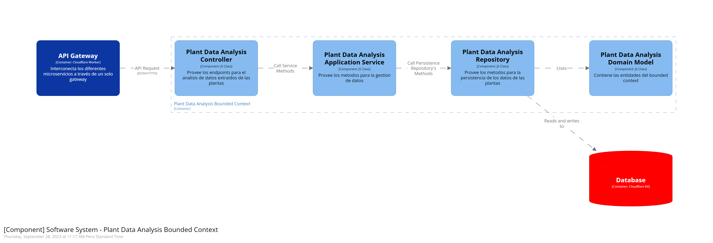
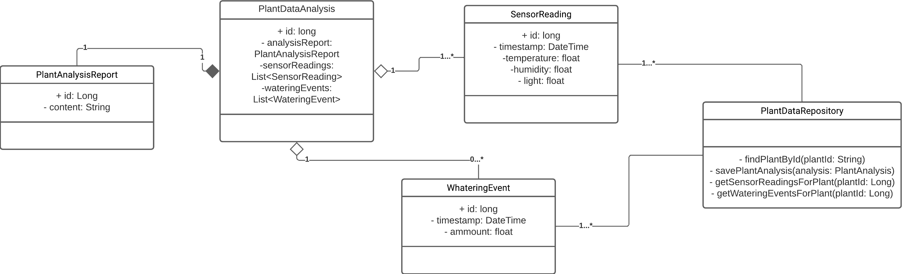
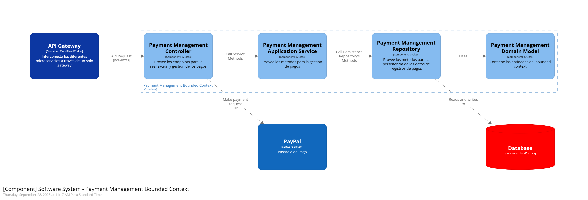
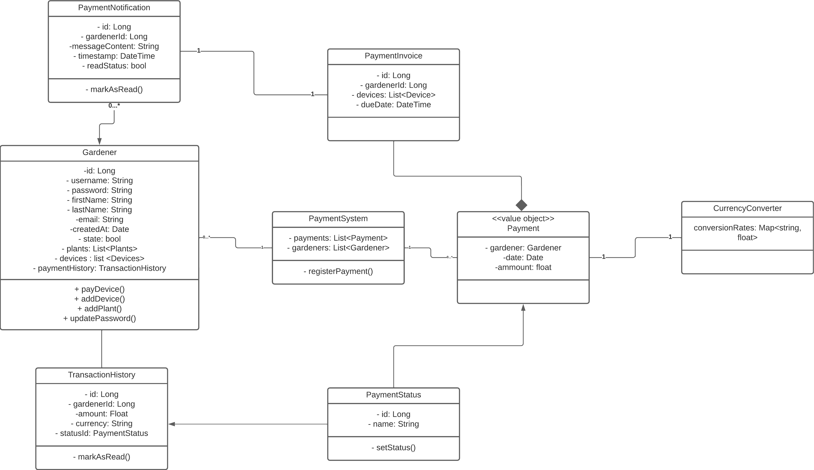

### Bounded Context: Plant Data Analysis

#### Domain Layer

##### Entities

- `PlantAnalysisReport`: Entidad que representa el reporte generado del análisis de los datos de la planta. Puede incluir ideas, tendencias y recomendaciones para el cuidado de las plantas.
- `SensorData`: Esta entidad almacena los datos recopilados por los sensores del dispositivo IoT, como la temperatura, la humedad del suelo, la luz, etc. Cada registro de `SensorData` esta vinculado con una planta específica.
- `WateringHistory`: Esta entidad registra la información relacionada con el riego de las plantas. Puede incluir fecha y hora de riego, cantidad de agua administrada.
- `Recommendation`: Esta entidad puede almacenar recomendaciones generadas basándose en los datos analizados de la planta. Puedo incluir, recomendación, acciones sugeridas.

##### Métodos

- `analyzePlantData()`: Este método realiza el análisis de los datos recolectados de las plantas.
- `getPlantAnalysisReport(plantId)`: Devuelve el reporte del análisis para una planta especifica.
- `getPlantInfo()`: Devuelve información detallada de la planta, como tipo, ubicación y otros datos.
- `updatePlantInfo()`: Actualiza la información de la planta con nuevos datos.
- `getSensorData()`: Recupera los datos del sensor asociado a la planta.
- `getWateringHistory()`: Obtiene el historial de riego de la planta.
- `addWateringEvent()`: Registra un nuevo evento de riego en el historial.
- `getRecommendations()`: Recupera las recomendaciones relacionadas con el cuidado de la planta.
- `getRecommendation()`: Obtiene la recomendación actual para el cuidado de la planta.

##### Value Objects

- `SensorReading`: Para representar las lecturas de los sensores recopiladas por el dispositivo IoT, este Value Object podría incluir atributos como temperatura, humedad del suelo, niveles de luz, entre otros.
- `NotificationContent`: Encapsula el contenido de las notificaciones, incluyendo el mensaje, fecha, hora y otros datos relevantes.
- `PlantLocation`: Representa la ubicación física de las plantas que están siendo monitorizadas. Incluye latitud, longitud, altitud, etc.

##### Factories

- `PlantDataFactory`: Utilizada para crear instancias de la entidad `PlantDataEntity` y asegurarse de que se registren los datos necesarios para el análisis.
- `SensorDataFactory`: Para crear `SensorReading`, se usa para crear un esquema inicial de los datos de los sensores de lectura.
- `RecommendationFactory`: Utilizada para crear instancias de la entidad `Recommendation` con el texto apropiado y los datos claros.

##### Services

- `DataAnalysisService`: Este servicio realiza el análisis de los datos recolectados de las plantas.
- `NotificationService`: Este servicio se encarga de enviar notificaciones a los usuarios cada vez que sea necesario.
- `PlantAnalysisReportService`: Gestiona la creación y recuperación de informes de los análisis de las plantas, asegurándose que estén actualizados.

#### Interface Layer

La capa de interfaz en el contexto acotado _Bounded Context Plant Data Analysis_ juega un papel crucial al proporcionar puntos de entrada y mecanismos de interacción entre este contexto y otras partes del sistema. Esta capa se encarga de manejar las solicitudes y las respuestas, permitiendo que diferentes aplicaciones y módulos se comuniquen de manera efectiva con el dominio específico de este contexto. Aquí se detalla cómo se lleva a cabo esta interacción.

##### API REST

Este contexto acotado ofrece una API REST que sirve como interfaz principal para interactuar con sus funcionalidades. A través de esta API, los clientes pueden realizar operaciones relacionadas con el análisis de datos de plantas, el seguimiento de sensores y el cuidado de las plantas. Algunos de los recursos y operaciones disponibles incluyen:

- `/plants`: Permite la gestión de plantas, incluyendo la obtención de información detallada, actualizaciones y eliminación.
- `/plants/{plantId}/sensors`: Proporciona acceso a los datos recopilados por los sensores, lo que permite la recuperación de lecturas y la realización de análisis.
- `/plants/{plantId}/watering`: Ofrece información sobre el historial de riego de las plantas, incluyendo la adición de nuevos eventos de riego.
- `/plants/{plantId}/recommendations`: Facilita la obtención de recomendaciones para el cuidado de las plantas y la consulta de recomendaciones específicas.

##### Interacciones con aplicaciones web y móviles

Este contexto acotado es compatible tanto con aplicaciones web como con aplicaciones móviles. Las aplicaciones web pueden hacer uso de las APIs REST mencionadas anteriormente para presentar información detallada y análisis de plantas en sus interfaces de usuario. Por otro lado, las aplicaciones móviles pueden realizar llamadas a las mismas APIs para proporcionar a los usuarios una experiencia móvil enriquecida y la capacidad de monitorear y cuidar sus plantas desde dispositivos móviles.

##### Integración con otros contextos acotados

Para garantizar la coherencia y la colaboración en el sistema, este contexto acotado se integra con otros contextos acotados relevantes mediante mecanismos de eventos y mensajes. Esto permite la sincronización de datos y la colaboración en la gestión de plantas y el análisis de datos en el sistema general.

##### Seguridad y autenticación

La seguridad es una prioridad en esta capa de interfaz. Las solicitudes a las APIs están protegidas mediante autenticación, con métodos que pueden incluir tokens JWT u otros mecanismos de autenticación segura. Además, se aplican políticas de autorización para garantizar que los usuarios solo puedan acceder a los recursos y realizar operaciones permitidas según sus roles y permisos.

La capa de interfaz en el contexto _Bounded Context Plant Data Analysis_ se esfuerza por proporcionar una forma clara y segura de interactuar con el sistema, permitiendo a los usuarios y aplicaciones aprovechar al máximo el análisis de datos de plantas y el cuidado de las plantas de manera eficiente y efectiva.

#### Application Layer

La capa de aplicación en el contexto acotado _Bounded Context Plant Data Analysis_ desempeña un papel central en la ejecución de la lógica de negocio y la coordinación de operaciones relacionadas con el análisis de datos de plantas y el cuidado de las plantas. Esta capa se encarga de traducir las solicitudes provenientes de la capa de interfaz en acciones concretas en el dominio de la aplicación. A continuación, se describen las principales responsabilidades y funciones de la capa de aplicación:

- **Coordinación de Operaciones:** la capa de aplicación coordina y orquesta las operaciones en el dominio para cumplir con los casos de uso y las funcionalidades requeridas. Esto incluye la gestión de flujos de trabajo relacionados con el análisis de datos de plantas, la obtención de recomendaciones y el registro de eventos de riego.
- **Aplicación de Reglas de Negocio:** aquí es donde se aplican las reglas de negocio específicas del dominio. Por ejemplo, durante el análisis de datos de plantas, la capa de aplicación puede aplicar algoritmos y reglas para identificar tendencias, anomalías y recomendaciones de cuidado.
- **Interacción con el Dominio:** la capa de aplicación se comunica con el dominio a través de servicios y métodos proporcionados por las entidades y objetos de valor del dominio. Esto incluye la utilización de servicios como `DataAnalysisService` para realizar análisis de datos y `PlantAnalysisReportService` para la gestión de informes de análisis.
- **Gestión de Transacciones:** en situaciones donde las operaciones deben realizarse de manera transaccional, la capa de aplicación garantiza la integridad de los datos. Por ejemplo, al registrar un evento de riego en el historial, la capa de aplicación se asegura de que la operación sea atómica y exitosa.
- **Manejo de Errores y Excepciones:** la capa de aplicación maneja errores y excepciones de manera adecuada, proporcionando respuestas adecuadas a la capa de interfaz y registrando información relevante para el diagnóstico y la resolución de problemas.
- **Seguridad:** la seguridad es una consideración crítica en esta capa. Se asegura de que las solicitudes estén autorizadas y de que se apliquen políticas de seguridad, como la autenticación de usuarios y el control de acceso.

La capa de aplicación en el contexto _Bounded Context Plant Data Analysis_ representa el corazón del negocio y la lógica de cuidado de las plantas. Su diseño y funcionamiento eficaz son fundamentales para garantizar un análisis preciso de los datos de las plantas y proporcionar recomendaciones útiles a los usuarios.

#### Infrastructure Layer

En el contexto del proyecto _Bounded Context Plant Data Analysis_, la capa de infraestructura desempeña un papel fundamental en el soporte y la habilitación de las operaciones esenciales del sistema. Esta capa proporciona acceso a los diferentes mecanismos de almacenamiento de datos, servicios externos y herramientas necesarias para el funcionamiento eficiente de los microservices que componen este contexto acotado.

##### Almacenamiento de datos en Cloudflare KV

Cloudflare KV: En lugar de utilizar bases de datos tradicionales, el sistema utiliza Cloudflare KV para almacenar y gestionar los datos de las plantas recopilados de los sensores. Cloudflare KV ofrece un almacenamiento de clave-valor altamente escalable y distribuido que es adecuado para la gestión de datos de sensores en tiempo real. Cada planta tiene su propio conjunto de datos asociado, lo que facilita la recuperación y actualización de información específica de la planta.

##### Repositorios para Cloudflare KV

En la capa de infraestructura, se implementan los siguientes repositorios para interactuar con Cloudflare KV:

- `PlantDataRepository`: Gestiona la información de las plantas almacenada en Cloudflare KV, permitiendo la lectura y escritura de datos relacionados con cada planta, como lecturas de sensores y datos de análisis.
- `WateringHistoryRepository`: Administra el historial de riego de las plantas, registrando eventos de riego y proporcionando acceso a la información de riego almacenada en Cloudflare KV.

Estos repositorios abstraen la capa de aplicación de la complejidad del acceso directo a Cloudflare KV, facilitando la gestión de datos de plantas y riego en el sistema.

##### Integración con servicios externos

- _OpenWeatherMap_: Para mejorar la precisión de las recomendaciones de riego, el sistema se integra con OpenWeatherMap, un servicio externo que proporciona datos de pronóstico del tiempo. A través de esta integración, se obtiene información climática en tiempo real que se utiliza en el análisis de datos de plantas.
- _Firebase Cloud Messaging_: Para mantener a los usuarios informados y enviar notificaciones en tiempo real, el sistema aprovecha Firebase Cloud Messaging. Esta plataforma de mensajería en la nube permite enviar notificaciones a dispositivos móviles y navegadores web de manera eficiente.

#### Bounded Context Software Architecture Component Level Diagrams

#### Bounded Context Software Architecture Code Level Diagrams

En esta sección, exploraremos la arquitectura a nivel de código de nuestro contexto acotado _Plant Data Analysis_. Primero, examinaremos los diagramas de clases, que nos proporcionarán una visión detallada de las clases y sus relaciones en nuestro microservice. Luego, veremos cómo se estructuran y almacenan los datos en nuestra base de datos basada en Cloudflare KV. Estos diagramas son esenciales para comprender la estructura y el flujo de datos en nuestro sistema de análisis de datos de plantas.

##### Bounded Context Domain Layer Class Diagrams

El siguiente diagrama de clases detalla la estructura de datos y las relaciones en nuestro microservice _Plant Data Analysis_. Representa cómo nuestras clases interactúan para gestionar y analizar datos de plantas, lecturas de sensores y eventos de riego.

##### Bounded Context Database Design Diagram

En este contexto específico de desarrollo, hemos optado por no incluir un diagrama convencional de base de datos, como los utilizados en sistemas con bases de datos relacionales, debido a la elección de utilizar Cloudflare KV como nuestro sistema de almacenamiento de datos. Cloudflare KV es un servicio de almacenamiento de clave-valor que opera de manera diferente a las bases de datos relacionales tradicionales, lo que nos lleva a una estructura de datos más flexible y sin esquema fijo.

En lugar de un diagrama de base de datos típico con tablas y relaciones, en Cloudflare KV trabajamos con pares clave-valor, lo que nos brinda mayor libertad para diseñar la estructura de datos de acuerdo a nuestras necesidades específicas. Esto significa que definimos nuestras propias convenciones de nomenclatura de claves y estructura de datos de manera personalizada para nuestro contexto acotado de _Plant Data Analysis_.

###### Plant Data Analysis (Datos de Planta)

- Clave: `plant: {plantId}`
- Valor: Un objeto JSON que contiene los datos de la planta, como tipo, ubicación, etc.

###### Sensor Readings (Lecturas de Sensores)

- Clave: `sensor:{sensorId}:{timestamp}`
- Valor: Un objeto JSON que contiene las lecturas de sensores, como temperatura, humedad, luz, etc.

###### Watering Events (Eventos de Riego)

- Clave: `watering:{eventId}:{timestamp}`
- Valor: Un objeto JSON que contiene información sobre el evento de riego, como la cantidad de agua administrada.

###### Plant Analysis Reports (Informes de Análisis de Planta)

- Clave: `analysis:{plantId}:{reportId}`
- Valor: Un objeto JSON que representa el informe de análisis de planta, incluyendo ideas, tendencias y recomendaciones.

### Bounded Context: Payment Management

#### Domain Layer

##### Entities

- `Payment`: Entidad que representa un pago realizado por un cliente (gardener). Puede incluir detalles como el monto, la fecha y el estado del pago.
- `PaymentMethod`: Esta entidad representa los métodos de pago que los gardeners pueden utilizar, como tarjetas de crédito, PayPal, transferencias bancarias, etc.
- `TransactionFee`: Esta entidad registra las comisiones o tarifas aplicadas a las transacciones de pago. Puede incluir detalles sobre la cantidad de la comisión, la fecha y el tipo de transacción.
- `PaymentHistory`: Esta entidad representa el historial de pagos de un Gardener. Lleva un registro de todas las transacciones de pago realizadas por el Gardener a lo largo del tiempo.

##### Métodos

- `processPayment()`: Este método se utiliza para procesar un pago realizado por un cliente. Puede involucrar la validación del pago, la actualización del estado y la generación de registros de historial.
- `cancelPayment(paymentId)`: Permite a un cliente (gardener) cancelar un pago si la transacción aún no se ha completado.
- `getPaymentDetails()`: Obtiene los detalles completos de un pago, incluyendo el monto, la fecha y el estado actual.
- `addPaymentMethod()`: Permite a un Gardener agregar un nuevo método de pago a su perfil.
- `removePaymentMethod()`: Permite a un Gardener eliminar un método de pago de su perfil.
- `getAvailablePaymentMethods()`: Obtiene una lista de los métodos de pago disponibles para un Gardener.
- `calculateTransactionFee()`: Calcula la comisión aplicada a una transacción de pago basada en el monto de pago proporcionado.
- `getPaymentHistory()`: Obtiene todas las transacciones de pago registradas en el historial de un Gardener.
- `getTotalPaymentsForMonth()`: Calcula el total de pagos realizados por un Gardener en un mes y año específicos.

##### Value Objects

- `PaymentStatus`: Un objeto de valor que representa el estado de un pago, como "pendiente", "completado", "rechazado", etc.
- `PaymentDetails`: Contiene detalles específicos de un pago, como el monto, la moneda, la fecha y la descripción del pago.
- `TransactionReference`: Se usa para rastrear y vincular una transacción de pago con información adicional, como un número de referencia único.
- `Money`: Se utiliza para representar una cantidad de dinero. Puede incluir el monto y la moneda, lo que facilita el manejo de diferentes monedas.

##### Factories

- `PaymentFactory`: Se encarga de crear instancias de la entidad Payment (Pago). Encapsula la lógica de creación de pagos y garantiza que los pagos se creen de manera consistente con los detalles necesarios, como el monto, la fecha y el estado del pago.
- `PaymentMethodFactory`: Se encarga de crear instancias de la entidad PaymentMethod. Gestiona la creación de métodos de pago, lo que puede incluir la configuración de métodos de pago como tarjetas de crédito, PayPal, transferencias bancarias, etc.
- `TransactionFeeFactory`: Se encarga de crear instancias de la entidad TransactionFee. Facilita la creación de comisiones de transacción que pueden aplicarse a las transacciones de pago.
- `PaymentHistoryFactory`: Se encarga de crear instancias de la entidad PaymentHistory. Gestiona la creación de historiales de pagos individuales para cada Gardener, lo que permite llevar un registro completo de todas las transacciones de pago a lo largo del tiempo.

##### Services

- `PaymentProcessingService`: Este servicio se encarga de procesar los pagos realizados por los gardeners.
- `PaymentHistoryService`: Este servicio gestiona la interacción con el historial de pagos de los gardeners. Permite la obtención de datos históricos de pagos, la generación de informes de transacciones y el cálculo de estadísticas de pagos, como el monto total pagado en un período específico.
- `PaymentMethodsService`: Este servicio se encarga de la gestión de métodos de pago utilizados por los gardeners. Permite a los usuarios agregar, editar o eliminar métodos de pago de sus perfiles, así como obtener la lista de métodos de pago disponibles.

#### Interface Layer

La capa de interfaz en el contexto acotado _Bounded Context Payment Management_ juega un papel fundamental al proporcionar puntos de entrada y mecanismos de interacción entre este contexto y otras partes del sistema. Esta capa se encarga de manejar las solicitudes y las respuestas, permitiendo que diferentes aplicaciones y módulos se comuniquen de manera efectiva con el dominio específico de este contexto. A continuación, se detalla cómo se lleva a cabo esta interacción.

##### API REST

Este contexto acotado ofrece una API REST que sirve como interfaz principal para interactuar con sus funcionalidades relacionadas con la gestión de pagos. A través de esta API, los clientes pueden realizar operaciones como procesar pagos, consultar historiales de pagos y administrar métodos de pago. Algunos de los recursos y operaciones disponibles incluyen:

- `/payments`: Permite la gestión de pagos, incluyendo la creación, actualización y obtención de detalles de pagos.
- `/payments/methods`: Facilita la administración de métodos de pago, como agregar nuevos métodos o eliminar métodos existentes.
- `/payments/history`: Proporciona acceso al historial de pagos, permitiendo la consulta de transacciones y la generación de informes.
- `/payments/fees`: Permite la consulta de comisiones de transacción y tarifas asociadas a los pagos.

##### Interacciones con aplicaciones web y móviles

Este contexto acotado es compatible tanto con aplicaciones web como con aplicaciones móviles. Las aplicaciones web pueden hacer uso de las APIs REST mencionadas anteriormente para presentar información detallada de pagos y métodos de pago en sus interfaces de usuario. Por otro lado, las aplicaciones móviles pueden realizar llamadas a las mismas APIs para proporcionar a los usuarios una experiencia móvil enriquecida y la capacidad de administrar sus pagos desde dispositivos móviles.

##### Integración con otros contextos acotados

Para garantizar la coherencia y la colaboración en el sistema, este contexto acotado se integra con otros contextos acotados relevantes mediante mecanismos de eventos y mensajes. Esto permite la sincronización de datos y la colaboración en la gestión de pagos en el sistema general.

##### Seguridad y autenticación

La seguridad es una prioridad en esta capa de interfaz. Las solicitudes a las APIs están protegidas mediante autenticación, con métodos que pueden incluir tokens JWT u otros mecanismos de autenticación segura. Además, se aplican políticas de autorización para garantizar que los usuarios solo puedan acceder a los recursos y realizar operaciones permitidas según sus roles y permisos.

La capa de interfaz en el contexto _Bounded Context Payment Management_ se esfuerza por proporcionar una forma segura y eficiente de gestionar pagos y métodos de pago, permitiendo a los usuarios y aplicaciones realizar transacciones de manera efectiva.

#### Application Layer

La capa de aplicación en el contexto acotado "Bounded Context Payment Management" es fundamental para la gestión de operaciones relacionadas con pagos y métodos de pago. Esta capa se encarga de traducir las solicitudes provenientes de la capa de interfaz en acciones concretas en el dominio de la aplicación de pagos. A continuación, se describen las principales responsabilidades y funciones de la capa de aplicación:

- **Procesamiento de pagos:** la capa de aplicación coordina y orquesta el procesamiento de pagos, garantizando que se realicen de manera segura y eficiente. Esto puede incluir la validación de pagos, la comunicación con pasarelas de pago externas (como PayPal) y el registro de pagos completados.
- **Administración de métodos de pago:** aquí se gestiona la administración de métodos de pago utilizados por los gardeners (clientes). La capa de aplicación permite a los usuarios agregar, editar o eliminar métodos de pago de sus perfiles, así como consultar los métodos de pago disponibles.
- **Cálculo de comisiones de transacción:** esta capa se encarga del cálculo de comisiones y tarifas asociadas a las transacciones de pago. Puede determinar las tarifas aplicables en función del monto de la transacción y el tipo de transacción.
- **Historial de pagos:** en situaciones donde las operaciones deben realizarse de manera transaccional, la capa de aplicación garantiza la integridad de los datos. Por ejemplo, al registrar un evento de riego en el historial, la capa de aplicación se asegura de que la operación sea atómica y exitosa.
- **Integración con pasarelas de pago externas:** cuando se utilizan pasarelas de pago externas, como PayPal, esta capa se encarga de la interacción con estas pasarelas para procesar pagos de manera segura y eficiente.
- **Seguridad y Validación:** la seguridad es una consideración crítica en esta capa. Se asegura de que las operaciones de pago sean seguras y que se apliquen políticas de seguridad, como la autenticación de usuarios y la validación de datos de pago.

La capa de aplicación en el contexto _Bounded Context Payment Management_ representa el núcleo de la gestión de pagos y métodos de pago. Su diseño y funcionamiento eficaz son esenciales para garantizar que las transacciones de pago se realicen correctamente y de manera segura.

#### Infrastructure Layer

En el contexto del proyecto _Bounded Context Payment Management_, la capa de infraestructura desempeña un papel crítico en el soporte y la habilitación de las operaciones esenciales del sistema. Esta capa proporciona acceso a los diferentes mecanismos de almacenamiento de datos, servicios externos y herramientas necesarias para el funcionamiento eficiente de los microservices que componen este contexto acotado.

##### Almacenamiento de datos en Cloudflare KV

Cloudflare KV: En lugar de utilizar bases de datos tradicionales, el sistema utiliza Cloudflare KV para almacenar y gestionar los datos de los pagos generados por los usuarios. Cloudflare KV ofrece un almacenamiento de clave-valor altamente escalable y distribuido que es adecuado para la gestión de datos de sensores en tiempo real. Cada planta tiene su propio conjunto de datos asociado, lo que facilita la recuperación y actualización de información específica de la planta.

###### Repositorios para Cloudflare KV

En la capa de infraestructura, se implementan los siguientes repositorios para interactuar con Cloudflare KV:

- `PaymentsRepository`: Se encarga de gestionar la información de los pagos almacenados en Cloudflare KV. Permite la lectura y escritura de datos relacionados con cada pago, como detalles de la transacción, monto y estado del pago.
- `PaymentMethodsRepository`: Administra la información de los métodos de pago almacenados en Cloudflare KV. Facilita la gestión de métodos de pago, incluyendo la adición, actualización y eliminación de métodos de pago asociados a cada Gardener.
- `TransactionFeesRepository`: Este repositorio se encarga de almacenar y recuperar datos relacionados con las comisiones y tarifas aplicadas a las transacciones de pago. Permite consultar información sobre las tarifas y sus características.
- `PaymentHistoryRepository`: Gestiona el historial de pagos almacenado en Cloudflare KV, registrando eventos de transacciones de pago. Proporciona acceso a la información de historial de pagos para la generación de informes y consultas de transacciones pasadas.

Estos repositorios abstraen la capa de aplicación de la complejidad del acceso directo a Cloudflare KV, lo que facilita la gestión de datos de pagos y métodos de pago en el sistema _Bounded Context Payment Management_. Cada repositorio se especializa en el acceso a un tipo específico de datos relacionados con los pagos y métodos de pago en el sistema.

##### Integración con pasarelas de pago externas

Cuando se utilizan pasarelas de pago externas, como PayPal, la capa de infraestructura se encarga de la integración con estas pasarelas. Esto implica la comunicación segura con los servicios de pasarela de pago, la gestión de respuestas y la actualización del estado de los pagos en el sistema.

#### Bounded Context Software Architecture Component Level Diagrams

#### Bounded Context Software Architecture Code Level Diagrams

En esta sección, exploraremos la arquitectura a nivel de código de nuestro contexto acotado _Payment Management_. Primero, examinaremos los diagramas de clases, que nos proporcionarán una visión detallada de las clases y sus relaciones en nuestro microservice. Luego, veremos cómo se estructuran y almacenan los datos en nuestra base de datos basada en Cloudflare KV. Estos diagramas son esenciales para comprender la estructura y el flujo de datos en nuestro sistema de procesamiento de pagos.

##### Bounded Context Domain Layer Class Diagrams

El siguiente diagrama de clases detalla la estructura de datos y las relaciones en nuestro microservice _Payment Management_. Representa cómo nuestras clases interactúan para gestionar y concretar todo el proceso de los pagos en nuestro sistema.

##### Bounded Context Database Design Diagram

En el contexto específico de desarrollo de _Bounded Context Payment Management_, hemos tomado la decisión de no incluir un diagrama convencional de base de datos, similar a los utilizados en sistemas con bases de datos relacionales tradicionales. Esto se debe a la elección de utilizar Cloudflare KV como nuestro sistema de almacenamiento de datos para gestionar la información relacionada con pagos y métodos de pago. Cloudflare KV es un servicio de almacenamiento de clave-valor que opera de manera diferente a las bases de datos relacionales, lo que nos permite una estructura de datos más flexible y sin esquema fijo.

En lugar de un diagrama de base de datos tradicional con tablas y relaciones, en Cloudflare KV trabajamos con pares clave-valor, lo que nos brinda una mayor libertad para diseñar la estructura de datos de acuerdo a nuestras necesidades específicas. Esto significa que definimos nuestras propias convenciones de nomenclatura de claves y estructura de datos de manera personalizada para nuestro contexto acotado de _Payment Management_.

A continuación, se describen las estructuras de datos clave-valor utilizadas en este contexto acotado:

###### Payment (Pago)

- Clave: `payment:{paymentId}`
- Valor: Un objeto JSON que contiene los datos del pago, como monto, estado de pago y detalles de la transacción.

###### Payment Method (Método de Pago)

- Clave: `payment-method:{methodId}`
- Valor: Un objeto JSON que representa un método de pago, como tarjeta de crédito, PayPal, etc.

###### Transaction Fee (Comisión de Transacción)

- Clave: `transaction-fee:{feeId}`
- Valor: Un objeto JSON que contiene información sobre una comisión de transacción, incluyendo la cantidad de la comisión y detalles de la transacción.

###### Payment History (Historial de Pagos)

- Clave: `payment-history:{gardenerId}:{paymentId}`
- Valor: Un objeto JSON que registra eventos relacionados con el historial de pagos, incluyendo detalles de transacciones pasadas.
