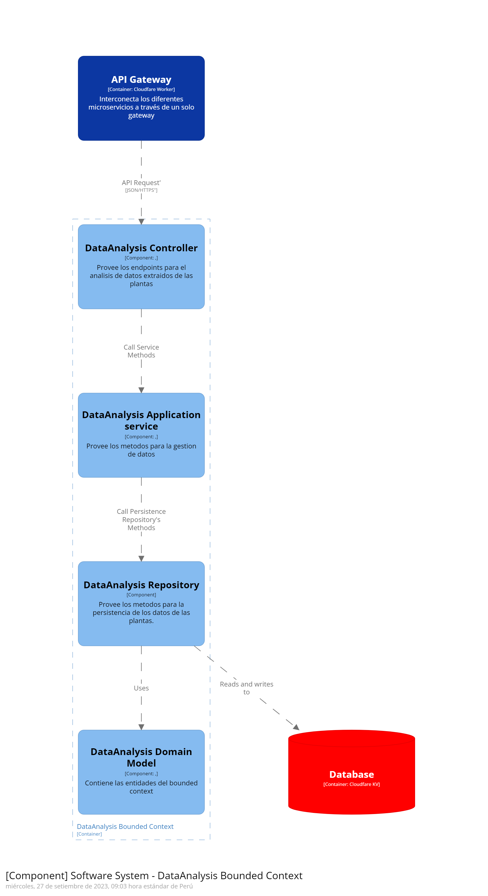
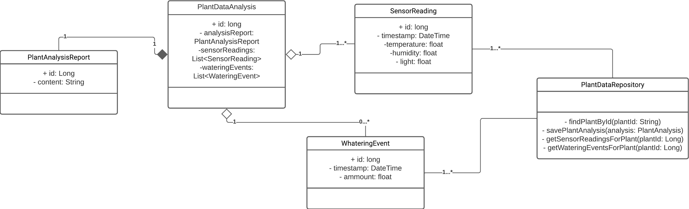

### Bounded Context: **Bounded Context Plant Data Analysis**

#### Domain Layer

**Entities:**

- PlantAnalysisReport: Entidad que representa el reporte generado del análisis de los datos de la planta. Puede incluir ideas, tendencias y recomendaciones para el cuidado de las plantas.
- SensorData: Esta entidad almacena los datos recopilados por los sensores del dispositivo IoT, como la temperatura, la humedad del suelo, la luz, etc. Cada registro de SensorData esta vinculado con una planta específica (Plant).
- Watering History: Esta entidad registra la información relacionada con el riego de las plantas. Puede incluir fecha y hora de riego, cantidad de agua administrada.
- Recommendation: Esta entidad puede almacenar recomendaciones generadas basándose en los datos analizados de la planta. Puedo incluir, recomendación, acciones sugeridas.

**Métodos:**

- analyzePlantData(): Este método realiza el análisis de los datos recolectados de las plantas.
- getPlantAnalysisReport(plantId): Devuelve el reporte del análisis para una planta especifica.
- getPlantInfo(): Devuelve información detallada de la planta, como tipo, ubicación y otros datos.
- updatePlantInfo(): Actualiza la información de la planta con nuevos datos.
- getSensorData(): Recupera los datos del sensor asociado a la planta.
- getWateringHistory(): Obtiene el historial de riego de la planta.
- addWateringEvent(): Registra un nuevo evento de riego en el historial.
- getRecommendations(): Recupera las recomendaciones relacionadas con el cuidado de la planta.
- getRecommendation(): Obtiene la recomendación actual para el cuidado de la planta.

**Value Objects:**

- SensorReading: Para representar las lecturas de los sensores recopiladas por el dispositivo IoT, este Value Object podría incluir atributos como temperatura, humedad del suelo y niveles de luz.
- NotificationContent: Encapsula el contenido de las notificaciones, incluyendo el mensaje, fecha, hora y otros datos relevantes.
- PlantLocation: Representa la ubicación física de las plantas que están siendo monitorizadas. Incluye latitud, altitud, etc.

**Factories:**

- PlantDataFactory: Utilizada para crear instancias de la entidad "PlantDataEntity" y asegurarse de que se registren los datos necesarios para el análisis.
- SensorDataFactory: Para crear "SensorReading", se usa para crear un esquema inicial de los datos de los sensores de lectura.
- RecommendationFactory: Utilizada para crear instancias de la entidad "Recommendation" con el texto apropiado y los datos claros.

**Services:**

- dataAnalysisService: Este servicio realiza el análisis de los datos recolectados de las plantas.
- notificationService: Este servicio se encarga de enviar notificaciones a los usuarios cada vez que sea necesario.
- plantAnalysisReportService: Gestiona la creación y recuperación de informes de los análisis de las plantas, asegurándose que estén actualizados.

#### Interface Layer

La capa de interfaz en el contexto acotado "Bounded Context Plant Data Analysis" juega un papel crucial al proporcionar puntos de entrada y mecanismos de interacción entre este contexto y otras partes del sistema. Esta capa se encarga de manejar las solicitudes y las respuestas, permitiendo que diferentes aplicaciones y módulos se comuniquen de manera efectiva con el dominio específico de este contexto. Aquí se detalla cómo se lleva a cabo esta interacción:

**API REST:**
Este contexto acotado ofrece una API REST que sirve como interfaz principal para interactuar con sus funcionalidades. A través de esta API, los clientes pueden realizar operaciones relacionadas con el análisis de datos de plantas, el seguimiento de sensores y el cuidado de las plantas. Algunos de los recursos y operaciones disponibles incluyen:

- /plants: Permite la gestión de plantas, incluyendo la obtención de información detallada, actualizaciones y eliminación.

- /sensor-data: Proporciona acceso a los datos recopilados por los sensores, lo que permite la recuperación de lecturas y la realización de análisis.

- /watering-history: Ofrece información sobre el historial de riego de las plantas, incluyendo la adición de nuevos eventos de riego.

- /recommendations: Facilita la obtención de recomendaciones para el cuidado de las plantas y la consulta de recomendaciones específicas.
  Interacción con Aplicaciones Web y Móviles:

Este contexto acotado es compatible tanto con aplicaciones web como con aplicaciones móviles. Las aplicaciones web pueden hacer uso de las APIs REST mencionadas anteriormente para presentar información detallada y análisis de plantas en sus interfaces de usuario. Por otro lado, las aplicaciones móviles pueden realizar llamadas a las mismas APIs para proporcionar a los usuarios una experiencia móvil enriquecida y la capacidad de monitorear y cuidar sus plantas desde dispositivos móviles.

**Integración con Otros Contextos Acotados:**
Para garantizar la coherencia y la colaboración en el sistema, este contexto acotado se integra con otros contextos acotados relevantes mediante mecanismos de eventos y mensajes. Esto permite la sincronización de datos y la colaboración en la gestión de plantas y el análisis de datos en el sistema general.

**Seguridad y Autenticación:**
La seguridad es una prioridad en esta capa de interfaz. Las solicitudes a las APIs están protegidas mediante autenticación, con métodos que pueden incluir tokens JWT u otros mecanismos de autenticación segura. Además, se aplican políticas de autorización para garantizar que los usuarios solo puedan acceder a los recursos y realizar operaciones permitidas según sus roles y permisos.

La capa de interfaz en el contexto "Bounded Context Plant Data Analysis" se esfuerza por proporcionar una forma clara y segura de interactuar con el sistema, permitiendo a los usuarios y aplicaciones aprovechar al máximo el análisis de datos de plantas y el cuidado de las plantas de manera eficiente y efectiva.

#### Application Layer

La capa de aplicación en el contexto acotado "Bounded Context Plant Data Analysis" desempeña un papel central en la ejecución de la lógica de negocio y la coordinación de operaciones relacionadas con el análisis de datos de plantas y el cuidado de las plantas. Esta capa se encarga de traducir las solicitudes provenientes de la capa de interfaz en acciones concretas en el dominio de la aplicación. A continuación, se describen las principales responsabilidades y funciones de la capa de aplicación:

**Coordinación de Operaciones:**
La capa de aplicación coordina y orquesta las operaciones en el dominio para cumplir con los casos de uso y las funcionalidades requeridas. Esto incluye la gestión de flujos de trabajo relacionados con el análisis de datos de plantas, la obtención de recomendaciones y el registro de eventos de riego.

**Aplicación de Reglas de Negocio:**
Aquí es donde se aplican las reglas de negocio específicas del dominio. Por ejemplo, durante el análisis de datos de plantas, la capa de aplicación puede aplicar algoritmos y reglas para identificar tendencias, anomalías y recomendaciones de cuidado.

**Interacción con el Dominio:**
La capa de aplicación se comunica con el dominio a través de servicios y métodos proporcionados por las entidades y objetos de valor del dominio. Esto incluye la utilización de servicios como **dataAnalysisService** para realizar análisis de datos y **plantAnalysisReportService** para la gestión de informes de análisis.

**Gestión de Transacciones:**
En situaciones donde las operaciones deben realizarse de manera transaccional, la capa de aplicación garantiza la integridad de los datos. Por ejemplo, al registrar un evento de riego en el historial, la capa de aplicación se asegura de que la operación sea atómica y exitosa.

**Manejo de Errores y Excepciones:**
La capa de aplicación maneja errores y excepciones de manera adecuada, proporcionando respuestas adecuadas a la capa de interfaz y registrando información relevante para el diagnóstico y la resolución de problemas.

**Seguridad:**
La seguridad es una consideración crítica en esta capa. Se asegura de que las solicitudes estén autorizadas y de que se apliquen políticas de seguridad, como la autenticación de usuarios y el control de acceso.

La capa de aplicación en el contexto "Bounded Context Plant Data Analysis" representa el corazón del negocio y la lógica de cuidado de las plantas. Su diseño y funcionamiento eficaz son fundamentales para garantizar un análisis preciso de los datos de las plantas y proporcionar recomendaciones útiles a los usuarios.

#### Infrastructure Layer

En el contexto del proyecto "Bounded Context Plant Data Analysis", la capa de infraestructura desempeña un papel fundamental en el soporte y la habilitación de las operaciones esenciales del sistema. Esta capa proporciona acceso a los diferentes mecanismos de almacenamiento de datos, servicios externos y herramientas necesarias para el funcionamiento eficiente de los microservices que componen este contexto acotado.

**Almacenamiento de Datos en Cloudflare KV:**

Cloudflare KV: En lugar de utilizar bases de datos tradicionales, el sistema utiliza Cloudflare KV para almacenar y gestionar los datos de las plantas recopilados de los sensores. Cloudflare KV ofrece un almacenamiento de clave-valor altamente escalable y distribuido que es adecuado para la gestión de datos de sensores en tiempo real. Cada planta tiene su propio conjunto de datos asociado, lo que facilita la recuperación y actualización de información específica de la planta.
Repositorios para Cloudflare KV

En la capa de infraestructura, se implementan los siguientes repositorios para interactuar con Cloudflare KV:

PlantDataRepository: Gestiona la información de las plantas almacenada en Cloudflare KV, permitiendo la lectura y escritura de datos relacionados con cada planta, como lecturas de sensores y datos de análisis.

WateringHistoryRepository: Administra el historial de riego de las plantas, registrando eventos de riego y proporcionando acceso a la información de riego almacenada en Cloudflare KV.

Estos repositorios abstraen la capa de aplicación de la complejidad del acceso directo a Cloudflare KV, facilitando la gestión de datos de plantas y riego en el sistema.

**Integración con Servicios Externos:**

OpenWeatherMap: Para mejorar la precisión de las recomendaciones de riego, el sistema se integra con OpenWeatherMap, un servicio externo que proporciona datos de pronóstico del tiempo. A través de esta integración, se obtiene información climática en tiempo real que se utiliza en el análisis de datos de plantas.

Firebase Cloud Messaging: Para mantener a los usuarios informados y enviar notificaciones en tiempo real, el sistema aprovecha Firebase Cloud Messaging. Esta plataforma de mensajería en la nube permite enviar notificaciones a dispositivos móviles y navegadores web de manera eficiente.

#### Bounded Context Software Architecture Component Level Diagrams

#### Bounded Context Software Architecture Code Level Diagrams

En esta sección, exploraremos la arquitectura a nivel de código de nuestro contexto acotado 'PlantDataAnalysis'. Primero, examinaremos los diagramas de clases en el 'Bounded Context Domain Layer Class Diagrams', que nos proporcionarán una visión detallada de las clases y sus relaciones en nuestro microservice. Luego, en el 'Bounded Context Database Design Diagram', veremos cómo se estructuran y almacenan los datos en nuestra base de datos basada en Cloudflare KV. Estos diagramas son esenciales para comprender la estructura y el flujo de datos en nuestro sistema de análisis de datos de plantas

##### Bounded Context Domain Layer Class Diagrams

El siguiente diagrama de clases detalla la estructura de datos y las relaciones en nuestro microservice 'PlantDataAnalysis'. Representa cómo nuestras clases interactúan para gestionar y analizar datos de plantas, lecturas de sensores y eventos de riego."

##### Bounded Context Database Design Diagram

En este contexto específico de desarrollo, hemos optado por no incluir un diagrama convencional de base de datos, como los utilizados en sistemas con bases de datos relacionales, debido a la elección de utilizar Cloudflare KV como nuestro sistema de almacenamiento de datos. Cloudflare KV es un servicio de almacenamiento de clave-valor que opera de manera diferente a las bases de datos relacionales tradicionales, lo que nos lleva a una estructura de datos más flexible y sin esquema fijo.

En lugar de un diagrama de base de datos típico con tablas y relaciones, en Cloudflare KV trabajamos con pares clave-valor, lo que nos brinda mayor libertad para diseñar la estructura de datos de acuerdo a nuestras necesidades específicas. Esto significa que definimos nuestras propias convenciones de nomenclatura de claves y estructura de datos de manera personalizada para nuestro contexto acotado de "Plant Data Analysis"

**Plant Data Analysis (Datos de Planta):**

- Clave: "plant: {plantId}"
- Valor: Un objeto JSON que contiene los datos de la planta, como tipo, ubicación, etc.

**Sensor Readings (Lecturas de Sensores):**

- Clave: "sensor:{sensorId}:{timestamp}"
- Valor: Un objeto JSON que contiene las lecturas de sensores, como temperatura, humedad, luz, etc.

**Watering Events (Eventos de Riego):**

- Clave: "watering:{eventId}:{timestamp}"
- Valor: Un objeto JSON que contiene información sobre el evento de riego, como la cantidad de agua administrada.

**Plant Analysis Reports (Informes de Análisis de Planta):**

- Clave: "analysis:{plantId}:{reportId}"
- Valor: Un objeto JSON que representa el informe de análisis de planta, incluyendo ideas, tendencias y recomendaciones.
