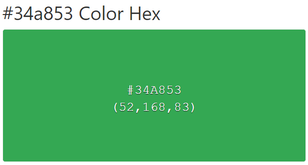
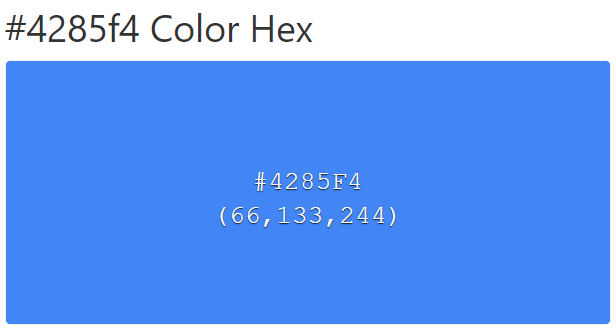
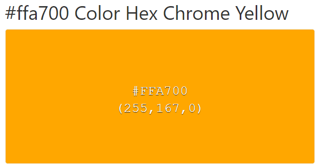
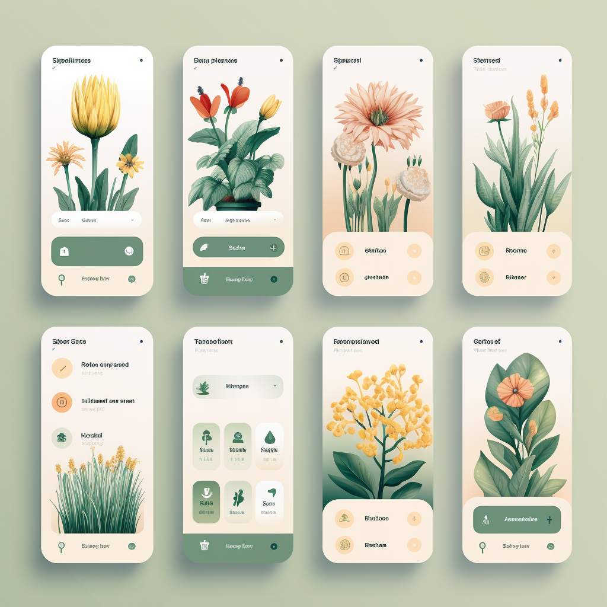

### Style Guidelines
En esta sección, el equipo sienta las bases para contar con un repositorio central y organizado de uso común para todo el equipo, que incluye color tones, fonts, typographies, etc. Esto con el fin de mantener una presentación consistente y enfocada.

#### General Style Guidelines

**Branding:**
- La marca "PlantGuard" se basa en valores de cuidado, simplicidad y sostenibilidad.
- Paleta de colores: verde para relacionarse con la naturaleza y tonos de azul para transmitir confiabilidad.
- Logo: Un logotipo que combina una hoja de planta y un escudo para representar la protección de las plantas.

- Tipografía: Fuente times-sans-serif moderna para reflejar la simplicidad y facilidad de uso.

**Typography:**
- Fuente principal: "Roboto" para legibilidad en dispositivos móviles.
- Tamaños de fuente: Encabezados en 24pt, texto principal en 16pt, botones en 18pt.
- Estilo de fuente: Negrita para encabezados, regular para texto principal.

**Colors:**
- Paleta de colores: #34A853 (verde), #4285F4 (azul), #FFA700 (naranja) para acentos.
- Verde para botones de acción, azul para elementos de navegación y naranja para notificaciones.

**Spacing:**
- Márgenes de 16px en elementos de la interfaz.
- Espaciado vertical de 8px, horizontal de 16px.
- Cuadrícula de diseño de 8 columnas para mantener la consistencia.

**Tono y Lenguaje:**
- Tono: Amigable y alentador.
- Lenguaje: Informal pero informativo.
- Redacción de contenido: Mensajes concisos y claros.

#### Web, Mobile & Devices Style Guidelines

**Interfaces Responsivas:**
- Diseño adaptativo para web y dispositivos móviles (teléfonos y tabletas).
- Resolución de referencia: 360x640 píxeles.
- Adaptación de diseño para orientación vertical y horizontal.

### Information Architecture

#### Labeling Systems

#### Searching Systems

#### SEO Tags and Meta Tags

#### Navigation Systems

### Landing Page UI Design

#### Landing Page Wireframe

#### Landing Page Mock-up

### Application UX/UI Design

#### Application Wireframes

#### Application Wireflow Diagrams

#### Application Mock-ups

#### Application User Flow Diagrams

### Application Prototyping
