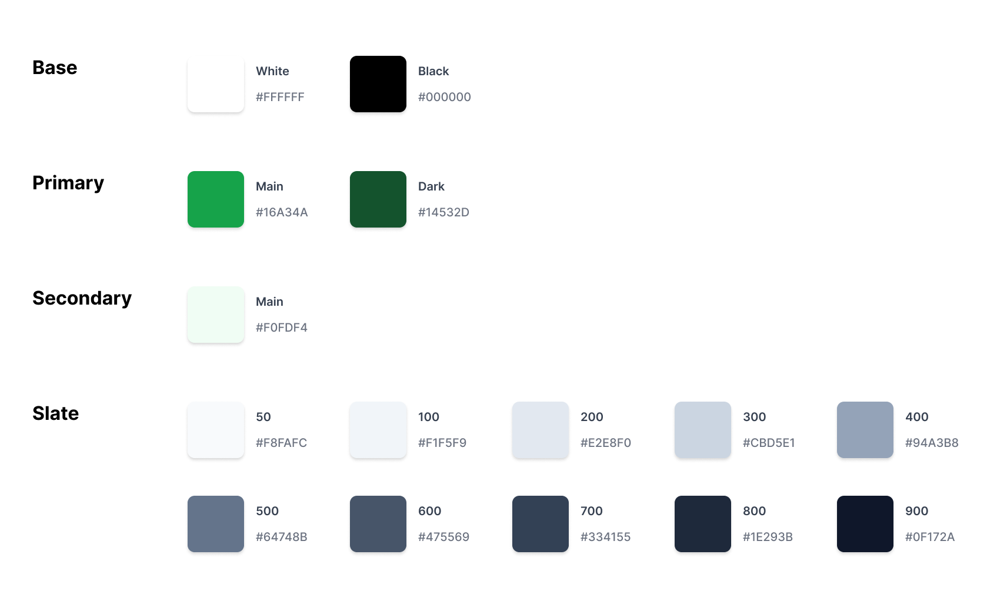
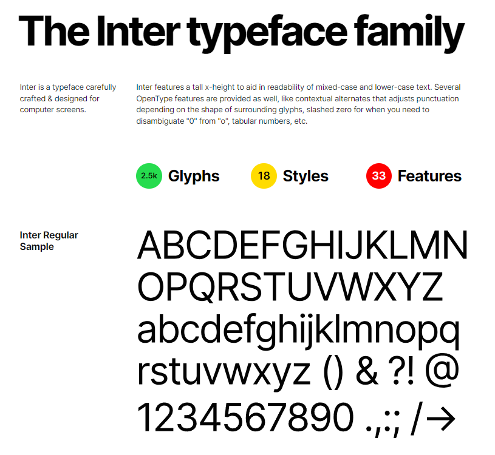
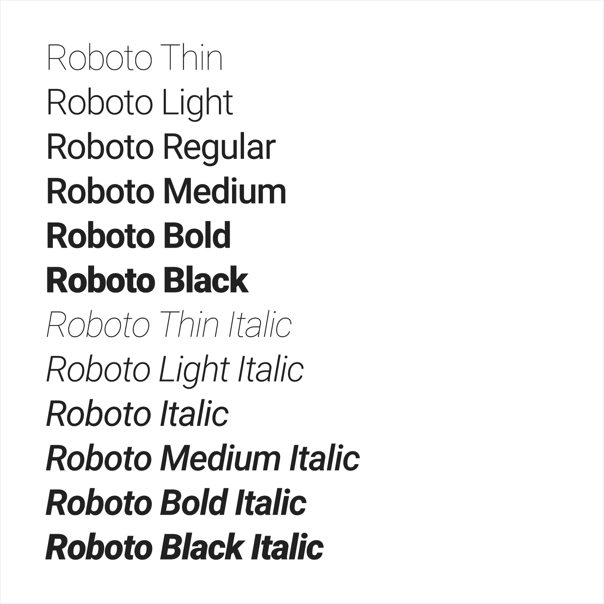
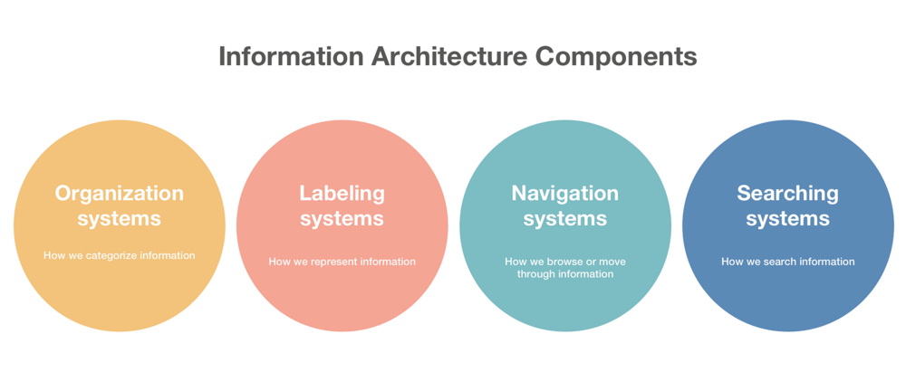
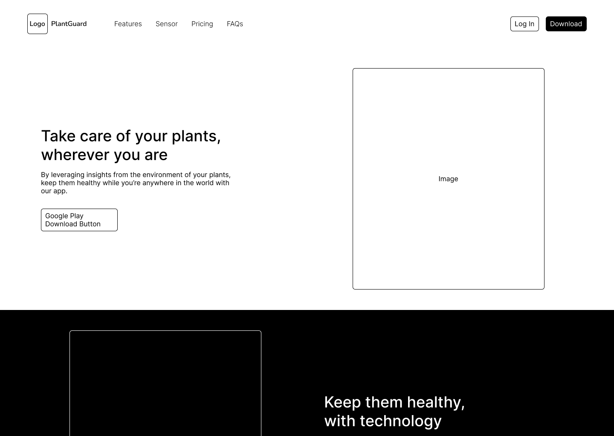
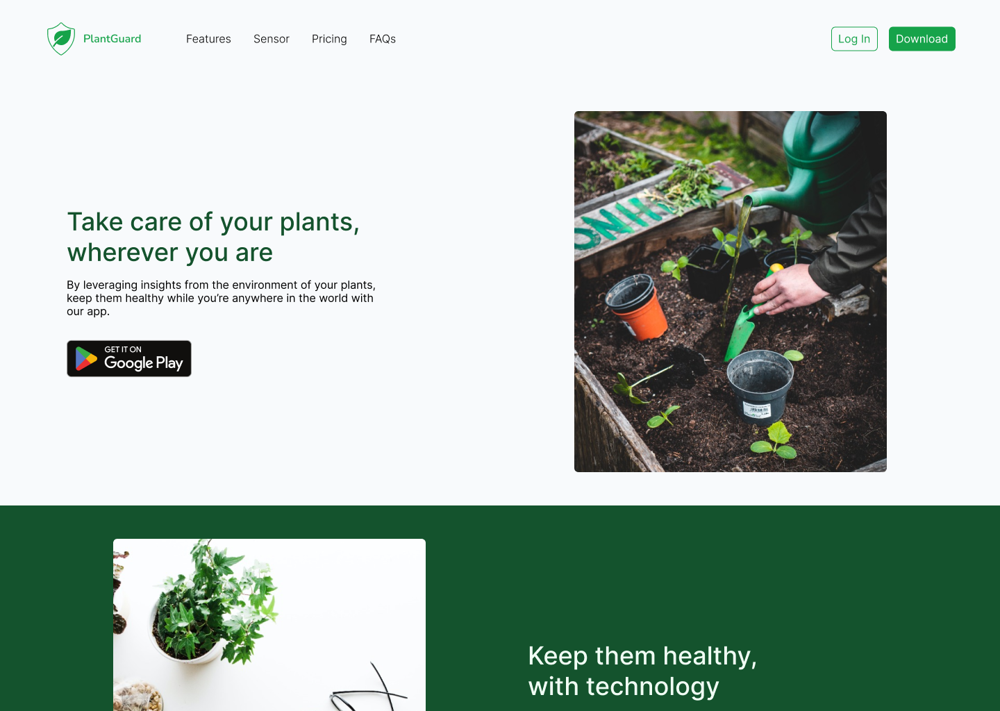
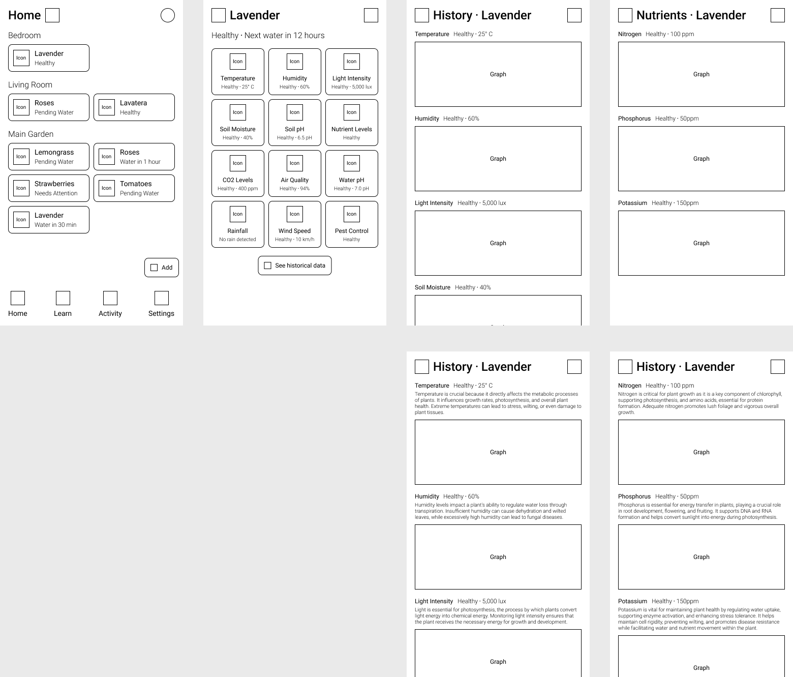
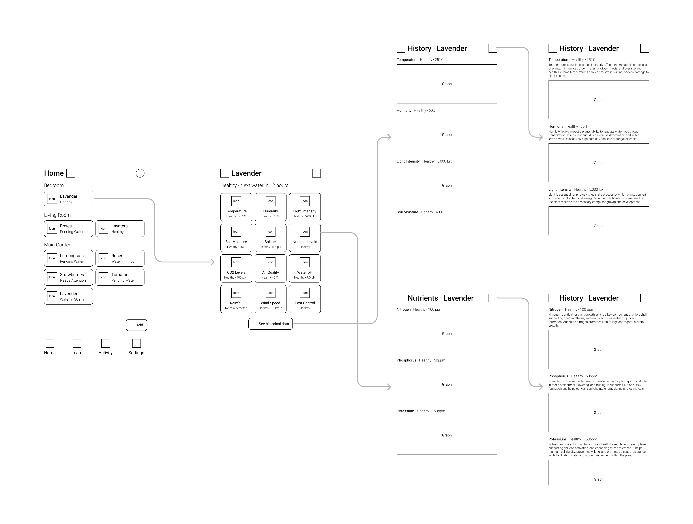
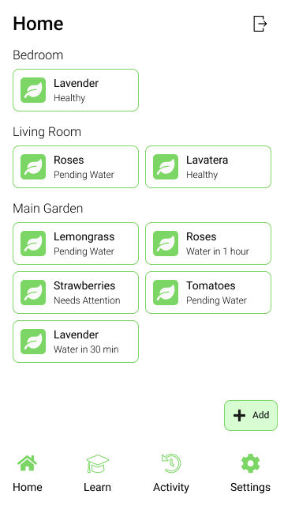
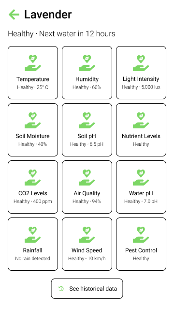

### Style Guidelines

En esta sección, el equipo sienta las bases para contar con un repositorio central y organizado de uso común para todo el equipo, que incluye color tones, fonts, typographies, etc. Esto con el fin de mantener una presentación consistente y enfocada.

#### General Style Guidelines

##### Branding

La marca _PlantGuard_ se basa en la idea de proteger y cuidar las plantas de manera sencilla. Los valores de la marca, como el cuidado y la sostenibilidad, se reflejan en la elección de colores y en el diseño del logotipo. El verde se asocia con la naturaleza y la frescura, mientras que el azul transmite confiabilidad y seguridad. El logotipo combina una hoja de planta para representar la naturaleza y un escudo para representar la protección de las plantas, lo que es coherente con la misión de la aplicación.

En cuanto a la tipografía, se utilizó _Nunito Sans_, una fuente moderna para reflejar la simplicidad y facilidad de uso.

##### Colors

La paleta de colores se eligió cuidadosamente para transmitir la esencia de la aplicación.

- El blanco y negro se aplica a elementos base de la aplicación.
- El verde normal y oscuro se utiliza para los botones y mayoría de controles, ya que es un color asociado con el crecimiento y la naturaleza.
- El verde muy claro se usa como color secundario junto a las otras tonalidades de verdes para crear contraste y que se de un toque de vitalidad.
- Las tonalidades de grises azulados permiten transmitir, así como el color azul, confianza y seguridad a nuestros usuarios.

##### Spacing

- Los márgenes de 16px proporcionan un espacio adecuado entre los elementos de la interfaz, mejorando la legibilidad y la apariencia ordenada.
- El espaciado vertical de 8px y el espaciado horizontal de 16px mantienen la consistencia y la alineación en la interfaz.
- La cuadrícula de diseño de 8 columnas ayuda a mantener la uniformidad en la disposición de elementos.

##### Tono y Lenguaje

- El tono de comunicación de la aplicación es amigable y alentador para establecer una relación positiva con los usuarios.
- El lenguaje es informal pero informativo, lo que hace que la aplicación sea accesible y fácil de entender.
- La redacción de contenido sigue principios de concisión y claridad para garantizar que los mensajes sean efectivos.

##### Interfaces Responsivas

- Se ha implementado un diseño adaptativo para garantizar que la aplicación sea accesible en diferentes dispositivos, incluyendo teléfonos móviles y tabletas.
- La resolución de referencia de 360x640 píxeles se adapta a la mayoría de los dispositivos móviles.
- El diseño se ajusta automáticamente según la orientación (vertical u horizontal) para una experiencia de usuario óptima.

#### Web, Mobile & Devices Style Guidelines

##### Web Style Guidelines

- Inter es un tipo de letra cuidadosamente elaborado y diseñado para pantallas de computadora.
- Esta fuente presenta una facilidad de legibilidad en el texto en mayúsculas y minúsculas mixtas.
- También se proporcionan varias funciones OpenType, como alternativas contextuales que ajustan la puntuación según la forma de los glifos circundantes, cero recortado para cuando necesite eliminar la ambigüedad de "0" de "o", números tabulares, etc.

##### Mobile Style Guidelines

Para el diseño de nuestra aplicación móvil, se tomará en cuenta en su mayor parte las recomendaciones de diseño de Material Design que plantea Google.

- Para la tipografía, la elección de la fuente tipográfica _Roboto_ se basa en su legibilidad en dispositivos móviles y su aspecto moderno.
- Los tamaños de fuente se seleccionaron para garantizar una experiencia de usuario cómoda, con encabezados más grandes para destacar información importante.
- El uso de negrita en encabezados agrega énfasis, mientras que el estilo regular se utiliza para el texto principal, lo que facilita la lectura.

### Information Architecture

Para los _Organization Systems_, la jerarquía visual se utiliza para destacar la información más relevante. Los menús paso a paso facilitan la configuración de plantas, lo que simplifica la experiencia del usuario. La categorización por tipo de planta ayuda a los usuarios a encontrar rápidamente lo que buscan.

#### Labeling Systems

Las etiquetas se eligen cuidadosamente para representar de manera clara y concisa la información. El uso de etiquetas sencillas evita la confusión y ayuda a los usuarios a comprender fácilmente el contenido y las funciones de la aplicación.

#### Searching Systems

La sección de _Searching Systems_ se centra en cómo los usuarios pueden buscar información dentro de la aplicación _PlantGuard_. Reconociendo que los usuarios pueden tener plantas de diferentes tipos y nombres, se ha implementado una barra de búsqueda ubicada en la parte superior de la aplicación para brindar una forma eficiente de acceder a información específica.

La barra de búsqueda permite a los usuarios escribir el nombre de una planta o su tipo, lo que les brinda la flexibilidad de encontrar rápidamente información relevante. Esta funcionalidad es esencial, ya que los usuarios pueden tener una variedad de plantas en su jardín y querrán acceder a detalles específicos sobre cada una de ellas.

Los resultados de búsqueda se presentan de manera clara y ordenada, con miniaturas de plantas acompañadas de sus nombres. Esta presentación visual facilita la identificación rápida de las plantas deseadas y mejora la experiencia de búsqueda del usuario.

#### SEO Tags and Meta Tags

##### SEO Tags (Para el sitio web)

La optimización para motores de búsqueda es esencial para aumentar la visibilidad de la aplicación en línea. Se han definido etiquetas de SEO como el título, la descripción y las palabras clave para mejorar la clasificación en los resultados de búsqueda.

##### ASO Elements (Para aplicaciones móviles)

Los elementos de optimización para tiendas de aplicaciones, como el título de la aplicación y las palabras clave, son cruciales para aumentar las descargas y la visibilidad en las tiendas de aplicaciones.

#### Navigation Systems

La navegación se mantiene sencilla con menús ubicados en la parte inferior de la aplicación para facilitar el acceso. Los botones de navegación están claramente etiquetados para guiar a los usuarios a través de las secciones clave de la aplicación.

### Landing Page UI Design

#### Landing Page Wireframe

A continuación, se muestra el diseño preliminar de nuestro landing page, el cual consta de múltiples secciones. Por limitaciones de espacio en el documento, se incluye una captura recortada, pero el diseño completo se puede apreciar en nuestro documento de Figma en el siguiente enlace: <https://www.figma.com/file/mG7P5xU4kz9bufozpHlMkd/PlantGuard-Landing-Page?type=design&node-id=0%3A1&mode=design&t=Xxqkfk9sOALArXtE-1>.

#### Landing Page Mock-up

A continuación, mostramos el diseño final como mockup de nuestro landing page. Al igual que en la sección anterior, se puede apreciar en nuestro documento de Figma en el siguiente enlace: <https://www.figma.com/file/mG7P5xU4kz9bufozpHlMkd/PlantGuard-Landing-Page?type=design&node-id=1-2&mode=design>.

### Application UX/UI Design

#### Application Wireframes

Estos son nuestros diseños de baja fidelidad para la interfaz de nuestra aplicación, la cual comprende las pantallas principales que el usuario navegará y visualizará al usarla.

Figma: <https://www.figma.com/file/sNp38DM5OmAygMD5tBn8Ph/PlantGuard-App?type=design&node-id=0%3A1&mode=design&t=cZN1QgKnH3B4lO1J-1>.

#### Application Wireflow Diagrams

En la presente sección, mostraremos los principales flujos de nuestra aplicación, conocidos también como _happy paths_. Estos evidencian el correcto uso del sistema a través del cumplimiento de una funcionalidad particular establecidad.

En este primer diagrama, vemos el flujo correcto que seguiría un usuario que usa la aplicación: empieza con la pantalla de inicio, donde puede ver todas las plantas que tiene registradas en el sistema. Una vez que encuentra la planta que desea ver más información, hace click en esta planta y se le lleva a una interfaz con todos los datos recopilados por el dispositivo IoT en tiempo real. En esta pantalla, el usuario puede ir a la sección de histórico y puede ver gráficas donde se le mostrará los rangos ideales para la planta registrada, así como los datos recopilados por el sistema. También podrá hacer click en un botón que mostrará una descripción de cada métrica, lo que le permitirá al usuario aprender la importancia de cada valor registrado.

También se puede apreciar un segundo posible flujo, en el que el usuario interactúa con la sección de nutrientes. Ya que esta sección se divide en tres nutrientes principales, se le muestra al usuario una interfaz más detallada sobre cada nutriente, con la misma opción se obtener más información sobre la importancia de estos.

Figma: <https://www.figma.com/file/LgrDW4JS98uSHRniVhJ89h/PlantGuard-Wireflow-Diagrams?type=whiteboard&node-id=0%3A1&t=sCPQNgfzoH0TN0c9-1>.

#### Application Mock-ups

Estos son nuestros diseños de media fidelidad para la interfaz de nuestra aplicación, la cual comprende las pantallas principales que el usuario navegará y visualizará al usarla.

#### Application User Flow Diagrams

### Application Prototyping
