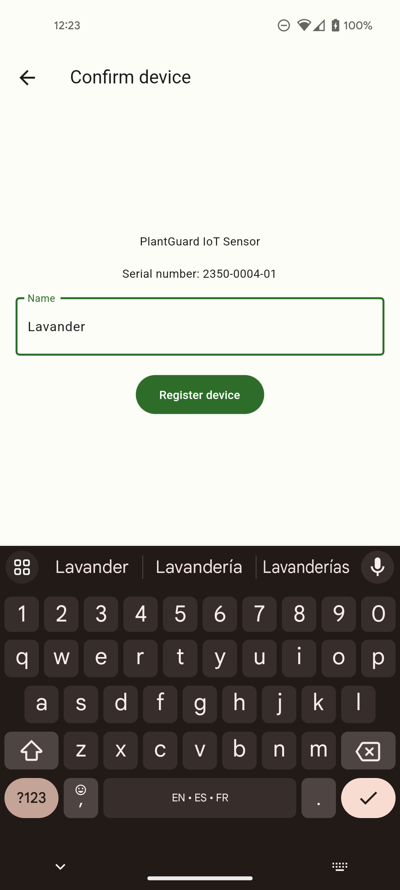
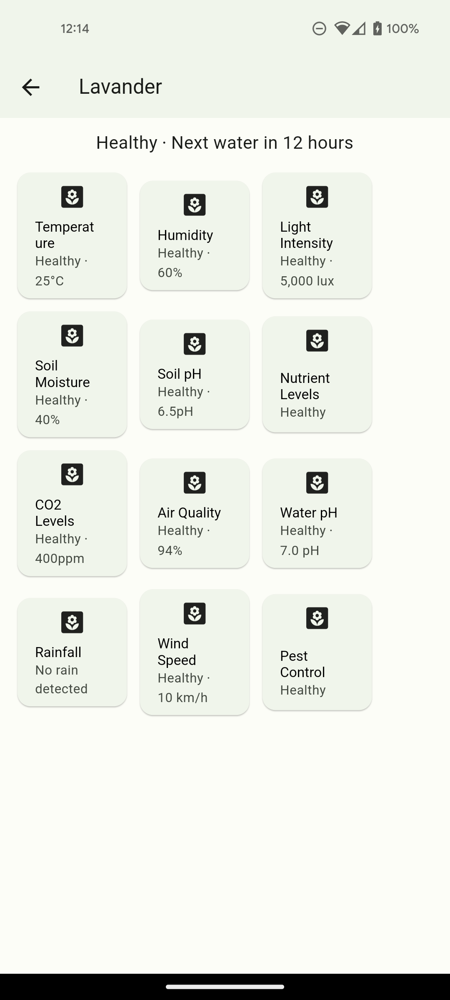

### Software Configuration Management

#### Software Development Environment Configuration

En el desarrollo de nuestro proyecto, hemos seleccionado el IDE de Visual Studio Code (<https://code.visualstudio.com/>) como la herramienta principal para la creación tanto de la aplicación móvil como del backend. Cada uno de estos componentes será desarrollado en lenguajes específicos, que detallaremos a continuación. Adicionalmente elegimos Visual Studio Code debido a que Wokwi ofrece una integración para ejecutar el simulador de forma local.

Para el desarrollo de la aplicación de prueba de concepto, hemos optado por el uso del framework Flutter (<https://flutter.dev>), el cual se basa en el lenguaje de programación Dart.

En el ámbito del backend, hemos elegido Cloudflare Workers (<https://workers.cloudflare.com/>) como nuestra herramienta de desarrollo. Esta elección se debe a su infraestructura generosa y gratuita.

Para la simulación de dispositivos IoT, hemos empleado Wokwi (<https://wokwi.com/>), una plataforma que nos permite acceder a un simulador completo de diversas placas y componentes directamente desde el navegador.

Además, como parte de nuestras herramientas de desarrollo en la nube (SaaS), confiamos en GitHub (<https://github.com/>) para la colaboración de código y aprovechamos GitHub Actions para la implementación continua y la entrega continua (CI/CD). También, contamos con LucidChart (<https://www.lucidchart.com>), Miro (<https://miro.com/>), Excalidraw (<https://excalidraw.com/>) y Structurizr (<https://structurizr.com/>) para la creación de diversos diagramas. Por último, utilizamos Figma (<https://www.figma.com/>) para la elaboración de nuestros diseños de interfaz de usuario, incluyendo wireframes, maquetas y prototipos.

#### Source Code Management

Hemos optado por emplear GitHub para gestionar y mantener un registro de las diferentes versiones de nuestro proyecto en desarrollo. Para ello, hemos creado una organización denominada NexGenius, que contiene todos los repositorios necesarios. Puedes encontrar estos repositorios en <https://github.com/nexgeniusupc/>.

En cuanto a la simulación de IoT que realizamos en Wokwi, es importante destacar que el código correspondiente no se gestiona mediante control de versiones. Esto se debe a que Wokwi es una plataforma en la nube dedicada a la simulación de dispositivos IoT, y no requiere control de versiones en el sentido tradicional. Para acceder a nuestra simulación, puedes visitar el siguiente enlace: <https://wokwi.com/projects/380426650740225025.>

Además, a continuación, proporcionamos los enlaces pertinentes a los repositorios de cada una de las soluciones implementadas en nuestro proyecto:

!include (../repositories.md)

#### Source Code Style Guide & Conventions

En cuanto a las convenciones para el control de versiones, utilizaremos Conventional Commits (<https://www.conventionalcommits.org/en/v1.0.0/>) tanto para la creación de ramas (aplicando `<type>/<title>`) como para la creación de commits (`<type>`(optional scope): `<description>`). Como, por ejemplo:

- Rama: feat/main-component
- Commit: feat: added main component template

Con respecto a la creación de ramas, se utilizarán feature branches siguiendo el modelo de GitHub Flow, con la nomenclatura mencionada previamente. Nuestra rama principal será la rama develop, la cual contendrá nuestra versión de la aplicación que se encuentra en producción. Todas las feature branches se realizarán a esta rama. Asimismo, tendremos una rama main para hacer el seguimiento del código desplegado en producción. A esta rama se realizarán los hotfixes, de ser necesarios.

#### Software Deployment Configuration

Para el despliegue de nuevas versiones de nuestra aplicación móvil, utilizaremos un repositorio privado de F-Droid (<https://f-droid.org/>), así como la publicación de APKs en GitHub Releases (<https://github.com/nexgeniusupc/plantguard-mobile/releases>).

Para el despliegue del backend, hemos realizado una integración con GitHub Actions la cual nos permite realizar despliegues automáticos con cada commit que sea enviado a las ramas main y develop. Estos harán despliegue a nuestros entornos de producción y staging respectivamente. Esta configuración puede ser visualizada en el siguiente enlace: <https://github.com/nexgeniusupc/plantguard-api/actions>.

### Solution Implementation

#### Sprint 1

##### Sprint Planning 1

Para este primer sprint, decidimos sentar las bases de la aplicación, empezando por la autenticación y la vinculación de dispositivos IoT (en este caso simulados en Wokwi) con una cuenta. Esto servirá para, en siguientes sprints, implementar funcionalidades que dependan de los datos que el dispositivo IoT pueda recopilar.

##### Sprint Backlog 1

| User Stories | User Stories | Work-Item / Task | Work-Item / Task | Work-Item / Task | Work-Item / Task | Work-Item / Task |
| Id | Title | Id | Title | Description | Estimation | Status |
| ------------ | ----------------------------------------- | -----------------| -----------------------------------------------------------------------------------------------| ----------------------------------------------------------------------------------------------- | ---------------- | ---------------- |
| US01 | Recopilación de datos de temperatura | PG01 | Setup y utilización inicial para que la app móvil recopile los datos de la temperatura. | Realizar configuración y lógica preeliminar para la recopilación de los datos de temperatura. | 4 hours | Done |
| US04 | Recomendaciones de falta de agua | PG02 | Setup y utilización inicial para que la app móvil haga recomendaciones sobre la falta de agua. | Realizar configuración y lógica preeliminar para las recomendaciones de falta de agua. | 4 hours | Done |
| US10 | Consejos para la elección de plantas | PG03 | Setup y utilización inicial para que la app móvil de consejos sobre elecciones de plantas. | Realizar configuración y lógica preeliminar para los consejos de elección de plantas. | 4 hours | Done |
| US11 | Sugerencias de nutrientes y fertilizantes | PG04 | Setup y utilización inicial para que la app móvil sugiera nuestrientes y fertilizantes. | Realizar configuración y lógica preeliminar para las sugerencias de nutrientes y fertilizantes. | 4 hours | Done |

##### Development Evidence for Sprint Review

El código de este prototipo preliminar desarrollado en Flutter se encuentra alojado en un repositorio en GitHub en el enlace: (<https://github.com/nexgeniusupc/fitster_demo>)

Asimismo, en este repositorio se encuentra la evidencia de los principales commits realizados para cumplir con los objetivos y tareas relacionados a esta primera iteración.

| Branch               | Commit id | Commit message                                    | Commited on (date) |
| -------------------- | --------- | ------------------------------------------------- | ------------------ |
| docs/release-v2.0.0  | 0f804f2   | Release v2.0.0                                    | 28/09/2023         |
| docs/release-v2.0.0  | 17a178a   | Fix some images overflowing height                | 28/09/2023         |
| docs/student-outcome | c804070   | Fix student outcome table breaks and styles       | 28/09/2023         |
| docs/release-v2.0.0  | e26f24f   | Use HTML cover page to pin date to bottom of page | 28/09/2023         |

##### Execution Evidence for Sprint Review

A continuación, mostramos algunas de las pantallas desarrolladas para esta entrega de la aplicación móvil.

##### Services Documentation Evidence for Sprint Review

Para el servicio de autenticación, se desarrollaron los siguientes endpoints:

- `POST /api/v1/auth/register`: Permite el registro de usuarios
  - `email`: string, debe ser email válido
  - `password` : string, min: 8 caracteres, max: 72 caracteres
  - `fullName`: string
  - `preferredName`: string
- `POST /api/v1/auth/login`: Retorna un token JWT firmado, valido por 30 días
  - `email`: string, debe ser email válido
  - `password` : string, min: 8 caracteres, max: 72 caracteres
- `/api/v1/users/me`: Retorna un `User` para el token JWT actual.
  - Requiere de la cabecera `Authorization` en el [formato Bearer](https://swagger.io/docs/specification/authentication/bearer-authentication/).

Para el servicio de dispositivos, se implementaron los siguientes endpoints. Todos requieren de la cabecera `Authorization` en el [formato Bearer](https://swagger.io/docs/specification/authentication/bearer-authentication/).

- `GET /api/v1/devices`: Lista todos los `Device`s registrados para el `User`. Acepta los siguientes parámetros query:
  - `limit`: number, min: 1, max: 50, opcional
  - `cursor` : string, opcional
- `GET /api/v1/devices/:id`: Obtiene un `Device` por su ID. Tiene los siguientes parámetros de ruta:
  - `id`: string, debe ser un UUID válido
- `PATCH /api/v1/devices/:id`: Updates an existing `Device` for the current `User`
  - Parámetros de ruta
    - `id`: string, debe ser un UUID válido
  - Respuesta en formato JSON
    - `name`: string, min: 1 char, max: 50 caracteres, opcional
- `DELETE /api/v1/devices/:id`: Elimina un `Device` por su ID. Tiene los siguientes parámetros de ruta:
  - `id`: string, debe ser un UUID válido

Para el servicio de pairing, se implemetaron los siguientes endpoints:

- `POST /api/v1/pair/init`: Inicializa el proceso de pairing de un `Device`
  - Body
    - `serialNumber`: string, debe cumplir el RegExp: `/\d{4}-\d{4}-\d{2}/g`
    - `expirationTtl` : number, max: 600, por defecto: 300
  - Respuesta
    - `code`: string, 6 dígitos, debe mostrarse en la pantalla del dispositivo IoT
    - `secret`: string, 64 caracteres, debe utilizar el dispositivo IoT para autenticarse en el endpoint de `/api/v1/pair/check`
- `GET /api/v1/pair/find`: Permite buscar por el código de pairing
  - Cabeceras
    - `Authorization` en el [formato Bearer](https://swagger.io/docs/specification/authentication/bearer-authentication/).
  - Parámetros query
    - `code`: string, 6 dígitos
  - Respuesta
    - `code`: string, 6 dígitos
    - `serialNumber`: string, cumple el RegExp: `/\d{4}-\d{4}-\d{2}/g`
- `POST /api/v1/pair/check`: Verifica si el `Device` ya ha sido autorizado por el `User`
  - Body
    - `code`: string, 6 dígitos
    - `secret`: string, 64 caracteres
  - Respuesta
    - Si el `User` aun no ha autorizado `Device`, el servidor retorna `204 No content` con el cuerpo vacío.
    - Si el `User` ya autorizó al `Device`, el servidor retorna
      - `jwt`: string, el dispositivo IoT debe guardar este token para los siguientes pedidos
- `POST /api/v1/pair/confirm`: Autoriza un `Device` en la cuenta del `User` actual
  - Cabeceras
    - `Authorization` en el [formato Bearer](https://swagger.io/docs/specification/authentication/bearer-authentication/).
  - Respuesta
    - `code`: string, 6 dígitos
    - `name`: string, min: 1 carácter, max: 50 caracteres

##### Software Deployment Evidence for Sprint Review

Utilizamos Cloudflare Workers para poder desplegar automáticamente el backend con cada cambio realizado por los miembros del equipo. Esta plataforma se integra con el repositorio de GitHub a través de GitHub Actions para detectar los cambios y generar despliegues para las ramas main y develop, siendo los entornos de producción y staging respectivamente. El enlace de la versión de producción es el siguiente: <https://plantguard-api.dalbitresb.com>.

##### Team Collaboration Insights during Sprint

Para esta primera entrega, los miembros del equipo colaboramos en conjunto para realizar las tareas establecidas y propiciar los primeros acercamientos a la solución completa, tanto a nivel de nuestro backend como el desarrollo de la aplicación móvil. En los repositorios podemos encontrar las principales contribuciones de cada miembro, así como en el presente informe se evidencia la colaboración e integración continua para otorgar la mayor calidad y el mejor esfuerzo en nuestra solución.

#### Sprint 2

##### Sprint Planning 2

Para este segundo sprint, hemos consolidado los cimientos previamente establecidos en el desarrollo de la aplicación. Nos enfocamos en perfeccionar la autenticación y la integración de dispositivos IoT (en este caso, simulados en Wokwi) con cuentas de usuario. Este paso crucial sienta las bases para el éxito final del proyecto, ya que ahora contamos con una sólida infraestructura que nos permitirá implementar de manera eficiente y efectiva las funcionalidades finales. En los sprints subsiguientes, nos centraremos en aprovechar al máximo los datos recopilados por los dispositivos IoT para ofrecer características avanzadas y completar con éxito este emocionante proyecto.

##### Sprint Backlog 2

##### Development Evidence for Sprint Review

##### Testing Suite Evidence for Sprint Review

##### Execution Evidence for Sprint Review

##### Services Documentation Evidence for Sprint Review

##### Software Deployment Evidence for Sprint Review

##### Team Collaboration Insights during Sprint

<!--
### Validation Interviews

#### Diseño de Entrevistas

#### Registro de Entrevistas

#### Evaluaciones según heurísticas
-->

### Video About-the-Product

En el presente video, los integrantes del equipo exponen sus puntos de vista acerca de los logros alcanzados durante el semestre con los contenidos explorados del curso y la realización del proyecto. Asimismo, plantean cómo estos nuevos conocimientos nos serán de utilidad de cara a nuestro futuro rol como profesionales en el rubro.

Disponible en YouTube: <https://youtu.be/7lNg8SHNEG8>.
